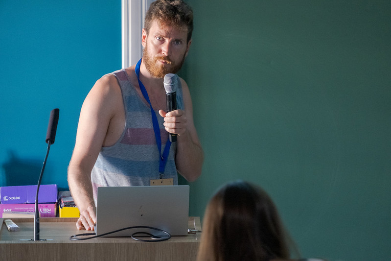
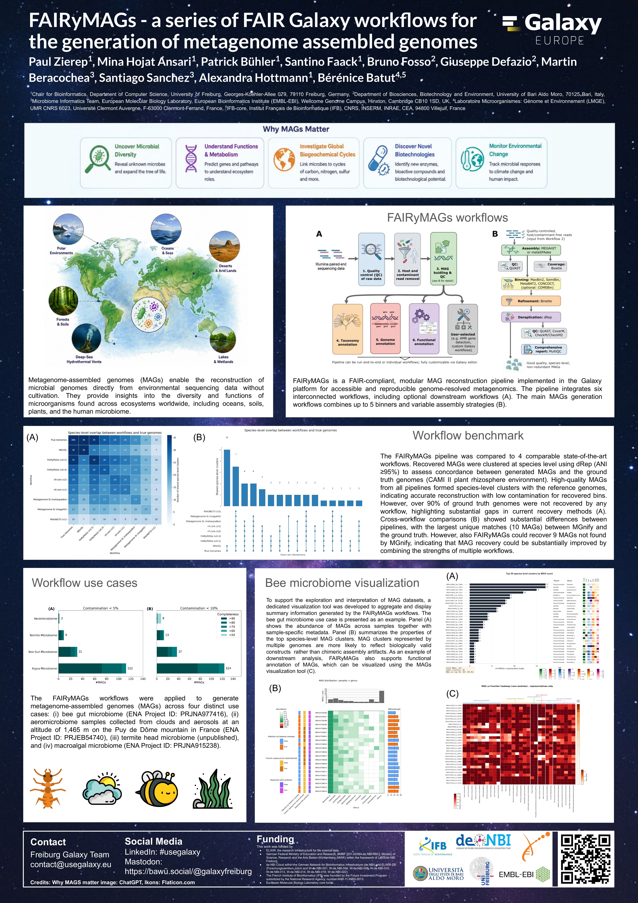

---
subsites:
- all
date: '2026-07-13'
title: Microbiological Data Analysis at the Galaxy Community Conference 2026 supported by the microGalaxy SIG 
tags: [tools, workflow, training]
tease: "Microbiological Data Analysis at Galaxy Community Conference 2026, Clermont-Ferrand, France"
contributions:
  authorship:
    - paulzierep
    - bebatut
  funding:
    - uni-freiburg
    - deNBI
    - elixir-de
    - elixir-europe
    - ifb
    - embl-ebi
    - uniba
---

## Microbiological Data Analysis at the Galaxy Community Conference 2026

We are proud that Bérénice Batut, lead of the microGalaxy SIG, was part of the local organizing committee that hosted GCC2026 in Clermont-Ferrand, France.

Apart from strong AI/ML focused developments in the Galaxy Ecosystem, the Microbiological Data Analysis capabilities empowered by the microGalaxy SIG were strongly presented at the Galaxy Community Conference 2026 in Clermont-Ferrand, France, 22–26 June. The community presented various talks and posters, hosted a reference data related BoF, and also pushed developments especially for the Galaxy Codex during the CoFest. Despite a scorching heatwave and widespread train cancellations making the commute difficult, we all made it and had a great time.

### Poster and talks

Paul Zierep and Bérénice Batut presented **FAIRyMAGs: A Modular, FAIR-Compliant Galaxy Workflow Suite for Flexible and Scalable Metagenome-Assembled Genome Reconstruction** ([Zenodo](https://zenodo.org/records/21128145)), a FAIR-compliant modular workflow suite for generating and analyzing MAGs, supported by the ELIXIR BFSP programme.

Mina Hojat Ansari presented **Galaxy-based workflows for genome-resolved and multi-kingdom microbiome analysis: application to the nasal microbiome in Alzheimer's disease**, demonstrating a comprehensive metagenomic analysis framework applied to 93 individuals (Alzheimer's disease patients, mild cognitive impairment, and healthy controls), leveraging the FAIRyMAGs workflow for genome-resolved analysis including diagnosis-level co-assembly.

A poster introduced the **Galaxy Communities Dock (CoDex)** ([GitHub](https://github.com/galaxyproject/galaxy_codex)), a centralized, manually curated repository that aggregates community-specific tools, workflows, and tutorials with automatic weekly updates. By combining technical infrastructure with human curation, CoDex supports communities in surfacing their most relevant resources and serves as a key element for **Labs** — user-friendly interfaces enabling communities to rapidly identify and launch resources without programming expertise.

Bérénice Batut, Engy Nasr, Nikos Pechlivanis, Nikolaos Strepis, and Paul Zierep presented **Microbiology Galaxy Lab: The first community-driven gateway for reproducible and FAIR analysis of microbiological data**. Built on the Galaxy framework, the Microbiology Galaxy Lab (MGL) provides a comprehensive environment for analyzing (meta)genomic, (meta)transcriptomic, and (meta)proteomic data, offering over 315 specialized tools and 115 curated workflows alongside 35+ tutorials and learning paths. Available on multiple Galaxy servers ([microbiology.usegalaxy.org](https://microbiology.usegalaxy.org), [.eu](https://microbiology.usegalaxy.eu), [.org.au](https://microbiology.usegalaxy.org.au), [.fr](https://microbiology.usegalaxy.fr)), MGL democratizes access to powerful bioinformatics tools for the microbiology community.

### Upcoming ELIXIR developments

As part of the ELIXIR F2F meeting, the microGalaxy SIG presented future developments under the ELIXIR Biodiversity, Food Security and Pathogens (BFSP) work programme starting in 2027, which will feature several tasks relevant to the community:

**Task 1 — FAIRification of analytical workflows** (Lead: Paul Zierep, DE-ALU). This task champions the FAIRification of computational workflows to ensure reproducibility, standardisation, and broader community adoption. Using a flagship workflow for state-of-the-art eukaryote metabarcoding, developed for Galaxy but also inspired by other workflow formalisms (such as nf-core), it will integrate resources like iBOL, GlobalFungi, UNITE, and others. Key deliverables include reusable workflows published in Galaxy IWC and WorkflowHub, automated tool deployments, and comprehensive training material within the Galaxy Training Network and TeSS. Knowledge gained will be used to build other FAIR workflows, such as eukaryotic pangenome analysis based on the E-PAN initiative. One or two hackathons will drive community engagement, establishing this process as a reproducible blueprint for FAIR workflows in the BFSP domains.

**Task 2 — Development of resource and training service catalogues** (Lead: Nikolaos Strepis, NL). This task broadly supports domain-specific communities in creating and maintaining their Community Resource Catalogues (CoReCas), collating tools, workflows, and training materials into a single interactive website. The immediate focus is the completion of the Microbiome Community prototype, **MiCoReCa** (Ashokan et al., 2025), fully grounded in the Research Software Ecosystem (RSEc) and integrating with Bio.tools, WorkflowHub, and TeSS to ensure comprehensive FAIRification of content.

**Task 3 — FAIRification of biodiversity and environmental genomics data** (Lead: Hanna Koivula, FI). Biodiversity and environmental genomics data are generated at scale but deposited inconsistently with heterogeneous metadata. This task improves the FAIR status of high-priority resources by extending existing ELIXIR infrastructure and aligning with international biodiversity standards (GBIF, TDWG, FAIRe, iBOL). Requirements for field-to-data-publication workflows will be defined and validated using concrete eDNA use cases from biodiversity monitoring and metagenomics projects, and incorporated into ELIXIR's best-practice guidelines and the RDMkit.

### CoFest

During CoFest, many microGalaxy members discussed with admins during the BoF how to improve reference data management, since most Microbiological Data Analysis workflows require large reference data sets — such as [MetaPhlAn](https://bio.tools/metaphlan), [Kraken](https://bio.tools/kraken), and [GTDB](https://bio.tools/gtdbtk) databases — which are hard to keep up to date for the community. The intermediate solution is a [git-based IDC](https://github.com/usegalaxy-eu/IDC) update logic which pushes reference data to [CVMFS](https://cvmfs.readthedocs.io/), alongside a harmonizing effort between [usegalaxy.eu](https://usegalaxy.eu) and CVMFS. For the long run, Marius van den Beek will lead the development of **data bundles** that combine reference data with metadata to facilitate and speed up the management of reference data by enabling better integration of community efforts in its update.

### Acknowledgements

Special thanks to the GCC2026 organizers in Clermont-Ferrand for hosting a wonderful conference, and to all poster and talk authors: Paul Zierep, Bérénice Batut, Mina Hojat Ansari, Engy Nasr, Nikos Pechlivanis, and Nikolaos Strepis — as well as the CoFest and BoF participants for the productive discussions on reference data management and Galaxy Codex development.

Finally, I would like to acknowledge the support from the University of Freiburg for funding my participation, and all [microGalaxy SIG](https://galaxyproject.org/community/sig/microgalaxy/) members for their continued contributions to the community.

