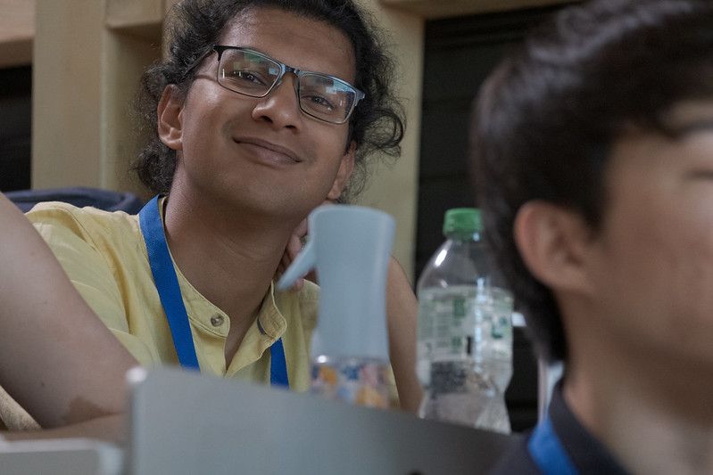
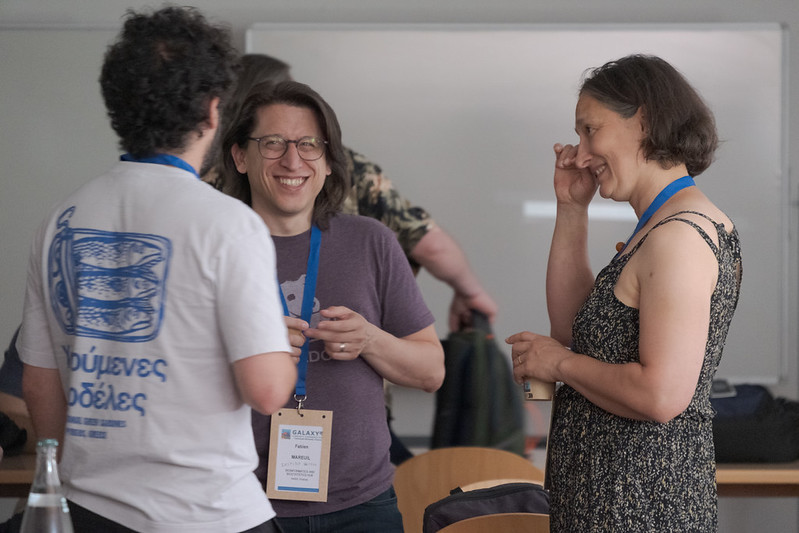
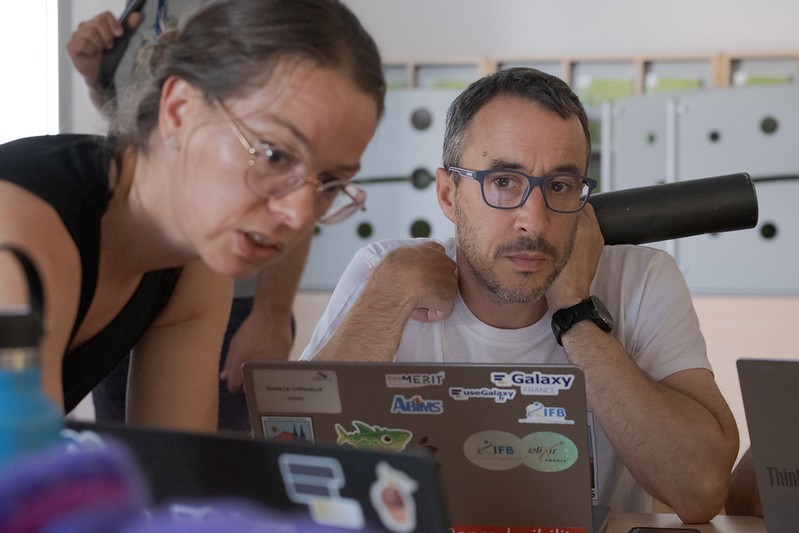
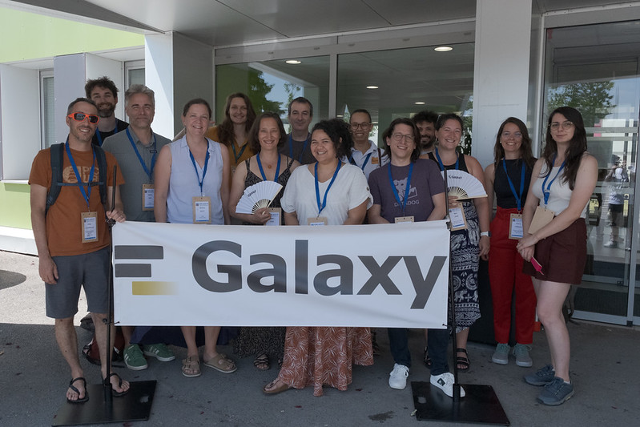
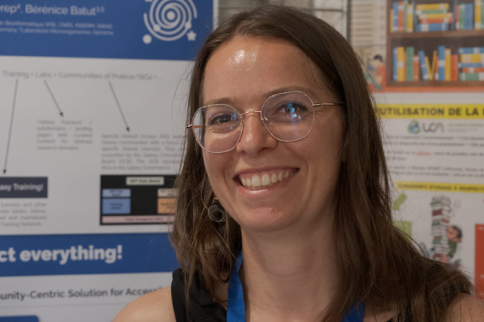
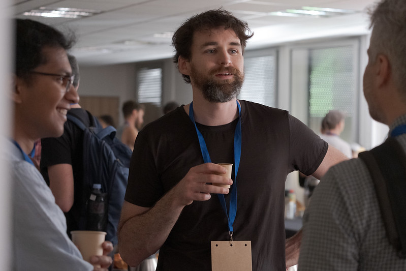
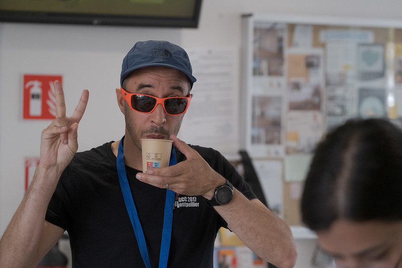
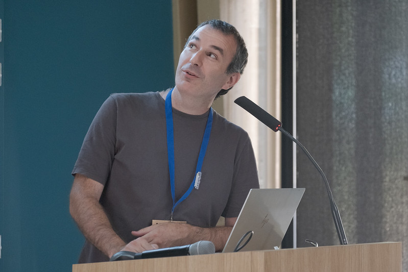
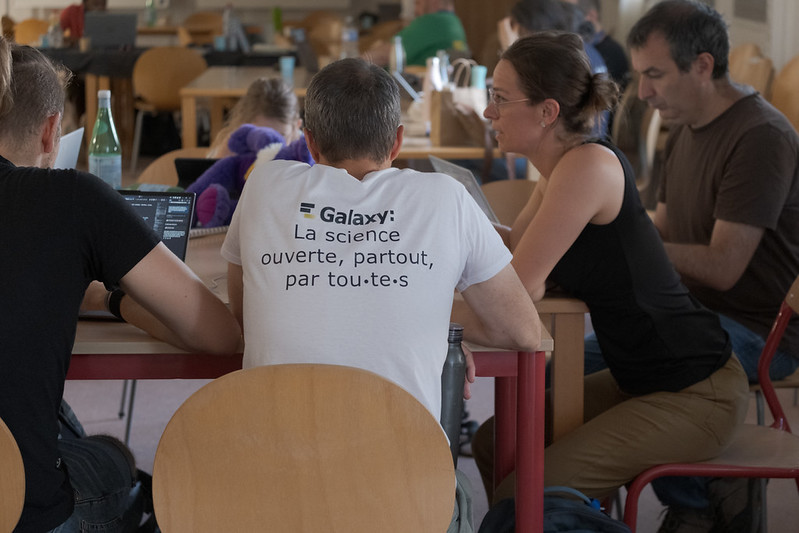

From **June 22 to 26, 2026**, the global Galaxy community gathered in **Clermont-Ferrand, France**, for the **[Galaxy Community Conference 2026 (GCC2026)](https://galaxyproject.org/events/gcc2026/)**—the flagship event for researchers, engineers, developers, and platform managers working with the Galaxy data analysis environment. Co-organized by **[Université Clermont Auvergne (UCA)](https://www.uca.fr/)**, **[French Institute of Bioinformatics (IFB/ELIXIR-FR)](https://www.france-bioinformatique.fr/)**, and **[Johns Hopkins University (USA)](https://www.jhu.edu/)**, this year's edition brought together **200 participants** to explore the latest advancements in **open science, large-scale data analysis, and the integration of AI in Galaxy**.

The conference featured **three days of talks and discussions**, followed by **two days of hands-on training and a collaborative hackathon (CoFest)**, where attendees advanced existing projects and launched new initiatives.

  <figure style="margin: 0;">
    
  </figure>
  <figure style="margin: 0;">
    
  </figure>
  <figure style="margin: 0;">
    
  </figure>

### Relive GCC2026

A **comprehensive recap** of the conference is available on the [Galaxy Project website](https://galaxyproject.org/news/2026-07-06-gcc2026-recap/), and all presentation videos are accessible on the **[GCC2026 YouTube playlist](https://www.youtube.com/playlist?list=PLB4YWcG-HSbw)**. This year's event placed a special emphasis on **AI-driven developments and applications within Galaxy**, with a dedicated session summary available [here](https://galaxyproject.org/news/2026-07-09-gcc2026-fishbowl-summary/).

## The French Bioinformatics Community at GCC2026

<figure style="margin: 1.5rem 0 2rem 0;">
  
</figure>

The **French Galaxy community** played a pivotal role throughout the conference, first by organizing it and then by contributing to sessions on **data analysis, community dynamics, and cross-disciplinary collaborations**. Beyond traditional "omics" fields, the community now embraces **"non-omics" domains**, including **Earth system science and ecology**, represented by members from **[Data Terra](https://www.data-terra.org/)**, the **Muséum de Concarneau**, and the **[BRGM](https://www.brgm.fr/)**.

  <figure style="margin: 0;">
    
  </figure>
  <figure style="margin: 0;">
    
  </figure>
  <figure style="margin: 0;">
    
  </figure>

Below, we highlight the **talks and posters** presented by French contributors, showcasing their innovative work and collaborations.

### Opening the Conference: A Look Back at the French Galaxy Community

As local organizers, Bérénice Batut, Gildas Le Corguillé, and Anthony Bretaudeau kicked off GCC2026 with a **historical overview of the French Galaxy community** ([slides](https://f1000research.com/slides/15-1124)). Anthony Bretaudeau later contributed to the **[Galaxy Community Update](https://galaxyproject.org/news/2026-07-06-gcc2026-recap/#galaxy-community-update)**, representing the French perspective.

<figure style="margin: 1.5rem 0 2rem 0;">
  
</figure>

## Contributions by Theme

### 🧬 Metagenomics & Microbiome

- **Talk & Poster**: [*FAIRyMAGs: A Modular, FAIR-Compliant Galaxy Workflow Suite for Flexible and Scalable Metagenome-Assembled Genome Reconstruction*](https://hal.science/hal-05685741)
  **Presenters**: Bérénice Batut & Paul Zierep
  **Summary**: A **collaborative effort** across **four ELIXIR nodes**, *FAIRyMAGs* delivers a **modular, FAIR-aligned workflow suite** for **MAG reconstruction and analysis**, developed under ELIXIR’s *"Biodiversity, Food Security, and Pathogens"* (BFSP) program.

- **Poster**: [*Microbiology Galaxy Lab: The First Community-Driven Gateway for Reproducible and FAIR Microbiological Data Analysis*](https://f1000research.com/posters/15-1114) ([HAL](https://hal.science/hal-05693236))
  **Presenters**: Bérénice Batut, Engy Nasr, Nikos Pechlivanis, Nikolaos Strepis, Paul Zierep
  **Summary**: The **Microbiology Galaxy Lab (MGL)** is a **global community platform** built on Galaxy, enabling **reproducible, FAIR-compliant microbiological data analysis**.

### 🌿 Biodiversity & Biotechnology

- **Poster**: [*The Biodiversity Genomics Galaxy Lab: A Collaborative Hub with Curated Tools, Workflows, and Training*](https://f1000research.com/posters/15-1166)
  **Presenters**: Solenne Correard, Bérénice Batut, Anthony Bretaudeau, ELIXIR Biodiversity Community, Robert M. Waterhouse
  **Summary**: A **thematic Galaxy subdomain** designed to make Galaxy’s bioinformatics resources **accessible and relevant** for **biodiversity genomics researchers**, featuring **curated tools, workflows, and tutorials**.

### 🛠️ Tools & Infrastructure

- **Poster**: [*Navigating Galaxy's Growth: How CoDex Lowers Barriers to Access*](https://f1000research.com/posters/15-1115) ([HAL](https://hal.science/hal-05693206))
  **Presenters**: Solenne Correard, Anthony Bretaudeau, Bérénice Batut, Paul Zierep
  **Summary**: Introducing the **Galaxy CoDex**, a **catalog of Galaxy resources (tools, tutorials, workflows)** that communities can **filter and expose** through **Galaxy Labs**—thematic subdomains tailored to specific research needs.

- **Poster**: [*Galaxy-BioProd: An Integrated FAIR Platform for Synthetic Biology, Biotechnology, and Life Cycle Analysis*](https://f1000research.com/posters/15-1175) ([HAL](https://hal.science/hal-05694938))
  **Presenters**: Anthony Pragassam, Thomas Chaussepied, Anthony Bretaudeau, Gildas Le Corguillé, Jean-Loup Faulon, Valentin Loux
  **Summary**: A collaboration with **[UseGalaxy.fr](https://usegalaxy.fr/)** to support **[Galaxy-BioProd](https://galaxy-bioprod.github.io/)**, a **FAIR-compliant platform** for **synthetic biology, biotechnology, and life cycle analysis**.

### Beyond the Conference: The Galaxy Summit

In addition to the main event, **Anthony Bretaudeau and Gildas Le Corguillé** represented the French community at the **Galaxy Summit**, an annual coordination meeting where international Galaxy leaders discussed **funding, UseGalaxy.* platforms, and the organization of future GCC events**.

<figure style="margin: 1.5rem 0 2rem 0;">
  
</figure>

*Photos in this post are by Bérénice Batut and are shared under a [CC BY-SA license](https://creativecommons.org/licenses/by-sa/4.0/).*