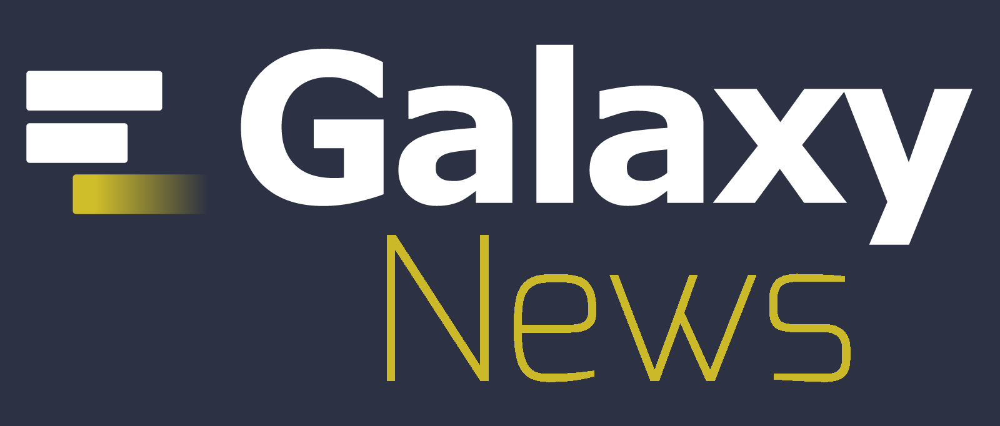
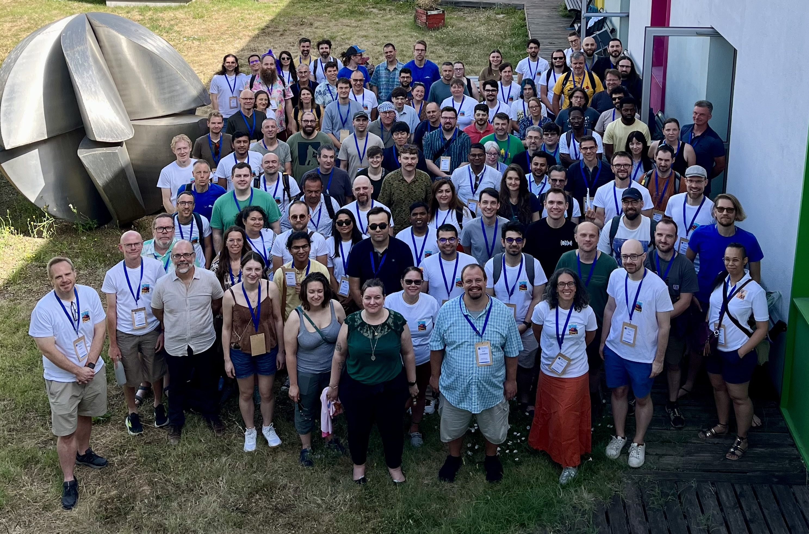
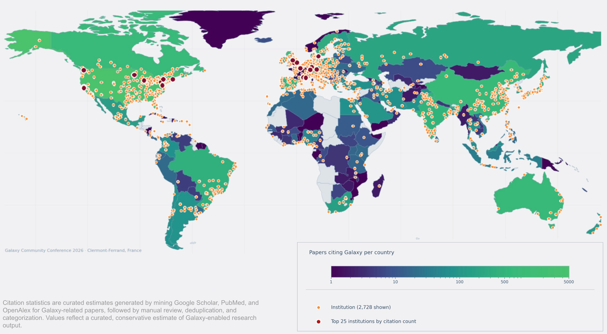
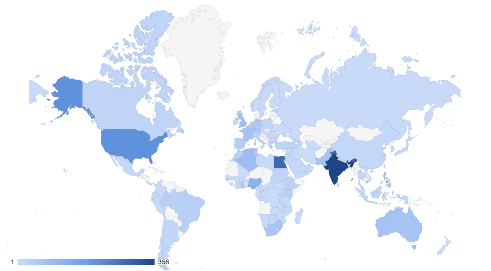
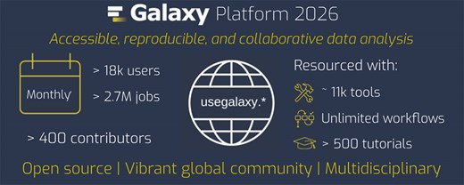
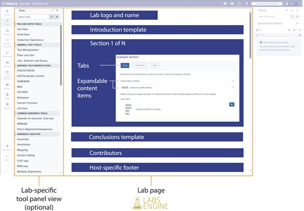

July 2026

Hello Galaxy Community,

The second quarter of 2026 brought the Galaxy community together through training, research, software development, and collaboration. In this issue, we look back at the Galaxy Community Conference 2026 in Clermont-Ferrand, reflect on a worldwide week of learning during the Galaxy Training Academy, and celebrate the publication of the latest Galaxy update in *Nucleic Acids Research*.

We also highlight new capabilities introduced in Galaxy 26.0, explore how Galaxy Labs are making community-curated research environments easier to build and share, and look ahead to upcoming opportunities to learn, connect, and contribute.

---

# GCC2026: Science, Collaboration, and Community in Clermont-Ferrand

The [2026 Galaxy Community Conference](https://galaxyproject.org/events/gcc2026/) brought researchers, developers, educators, trainers, infrastructure providers, students, and Galaxy users from around the world to Clermont-Ferrand, France, for a week of science, training, collaboration, and connection.

Hosted at IUT Clermont Auvergne, the conference featured seven scientific talk sessions spanning the Galaxy framework, infrastructure, FAIR workflows, public health, tool development, artificial intelligence, community platforms, and research applications. Attendees also connected through posters, demos, lightning talks, Birds of a Feather sessions, training, and CoFest.

A keynote from Rayan Chikhi of Institut Pasteur explored how massive public sequencing datasets can be assembled, indexed, and searched to support biological discovery. Galaxy Live! offered an energetic look at new and emerging platform capabilities, while the Galaxy Community Update highlighted continued progress across software, training, infrastructure, governance, and partnerships.

GCC2026 was also a celebration of the people behind Galaxy. Across formal sessions and informal conversations, the week demonstrated how open collaboration and shared infrastructure continue to move the project forward.

A special thank-you goes to the **Galaxy France team** for welcoming the global community to Clermont-Ferrand and for the tremendous work required to host GCC2026. Their planning, coordination, and hospitality created an environment where participants could exchange ideas, build new collaborations, and reconnect as a community.

> **Missed a session or want to revisit a favorite talk?** All GCC2026 recordings are now available in the [GCC2026 YouTube playlist](https://youtube.com/playlist?list=PLB4YWcG-HSbw&si=1n7bm-lCEUjxULsR), including the keynote, scientific sessions, community updates, Fishbowl discussion, and Galaxy in Research.

[**Read the full GCC2026 recap**](https://galaxyproject.org/news/2026-07-06-gcc2026-recap/)

## Fishbowl Discussion: AI, Galaxy, and Trustworthy Scientific Software

One of the most thoughtful conversations at GCC2026 focused on how Galaxy should engage with artificial intelligence (AI) while protecting the values that have shaped the project for more than 20 years: reproducibility, transparency, accessibility, openness, and trust.

Participants recognized that researchers are already using AI to identify tools, interpret errors, plan analyses, generate code, and explore results. At the same time, the discussion emphasized that AI should support scientific reasoning rather than replace it.

Several priorities emerged:

- AI-assisted work should remain auditable, with clear provenance and attribution.
- Assistance should help users understand tools, workflows, and errors rather than obscure the underlying science.
- Galaxy should connect users to trusted resources, including GTN tutorials, documentation, workflows, and community support.
- Human judgment must remain central, particularly when interpreting results or drawing scientific conclusions.
- The community should consider the environmental, ethical, educational, and social effects of AI adoption.
- AI should be optional and used where it provides genuine value, rather than added to every interaction by default.

The discussion reflected both optimism and care. Galaxy has a strong foundation for responsible AI-assisted research because histories, workflows, tool metadata, and transparent execution are already central to the platform. The challenge is to build on those strengths without weakening the human knowledge-sharing and collaboration that make the community successful.

[**Read the fishbowl discussion notes**](https://galaxyproject.org/news/2026-07-09-gcc2026-fishbowl-summary/)

## Galaxy in Research: From Infrastructure to Discovery

The Galaxy in Research session closed GCC2026 with **“Powering Discovery: A Research-First Look at Galaxy’s Impact.”** Rather than focusing on platform features, the presentation focused on the research stories behind Galaxy and a central question: **What has Galaxy made possible?**

Galaxy is often described through its tools, workflows, training resources, and computational infrastructure. The session followed that chain one step further, showing how those shared resources help turn complex data into evidence and scientific discovery. By making advanced methods accessible without local installation, preserving analyses as reusable workflows, and providing public compute and community support, Galaxy has helped transform computational barriers into shared research capacity.

A curated review of Galaxy-related literature illustrated the scale of that impact. The analysis identified **more than 15,600 unique papers**, representing **over 23,000 citations of Galaxy publications**, **163 countries and territories**, and **more than 9,300 research institutions**. These figures were generated by mining Google Scholar, PubMed, and OpenAlex, followed by manual review, deduplication, and categorization, and therefore represent a conservative estimate of Galaxy-enabled research.

The session also emphasized that some of Galaxy’s greatest impact appears not in a single publication, but in the scientific ecosystems that support many studies over time. Communities including the Vertebrate Genomes Project, ELIXIR Galaxy, Galaxy-P, the Galaxy Training Network, and microGalaxy have turned individual tools and methods into maintained resources, reusable workflows, shared training, and lasting scientific capacity.

Ultimately, the presentation argued that Galaxy’s legacy exists at multiple scales: an individual analysis becomes a published result; a method becomes a reusable workflow; a workflow becomes a community resource; and those resources become scientific infrastructure supporting new questions across many fields. That impact is a community achievement, built by the people who maintain tools, develop workflows, teach methods, run servers, write documentation, support users, and organize scientific communities.

[**Watch the Galaxy in Research session**](https://youtu.be/e10XFwUu1vc?t=17456)

---

# Galaxy Training Academy 2026: A Global Week of Learning

From May 18–22, the Galaxy Training Academy 2026 welcomed over 2,000 learners from around the world for a free, virtual week of hands-on training.

GTA combines self-paced Galaxy Training Network tutorials with live support from trainers and community members across time zones. This flexible model allows participants to learn at their own pace while still benefiting from real-time guidance, discussion, and connection with the broader Galaxy community.

The 2026 program included learning opportunities across a wide range of scientific and technical topics. A new **Meet the Experts** format also gave learners the opportunity to hear directly from researchers and developers, connect training activities to real-world applications, and ask questions about methods, tools, and career paths.

GTA2026 once again demonstrated what community-driven training can accomplish. The event was made possible by the instructors, tutorial contributors, support volunteers, organizers, and infrastructure teams who shared their time and expertise throughout the week.

Thank you to everyone who learned, taught, supported, and helped make GTA2026 possible.

[**Watch this year's Meet the Expert series**](https://youtube.com/playlist?list=PLNFLKDpdM3B97hDDDWytOj1Pj37XxEBed&si=H-51HwaJ6DJlrRyd)

[**Learn more about the Galaxy Training Network**](https://training.galaxyproject.org/)

---

# New Publication: The 2026 Galaxy Update

The latest Galaxy platform update, **“[Galaxy for accessible, reproducible, and collaborative data analyses: 2026 update](https://academic.oup.com/nar/article/54/W1/W105/8704296),”** has been published in *Nucleic Acids Research*.

Now in its third decade, Galaxy has grown into a global, community-driven platform serving more than 650,000 registered users. Major public Galaxy servers support approximately two million analysis jobs each month from around 20,000 users.

The 2026 paper describes a major modernization of the Galaxy experience, including:

- a broad redesign of the user interface;
- substantial improvements to workflow authoring, execution, and inspection;
- more flexible data management, including scratch storage and user-defined repositories;
- a modern visualization architecture;
- continued growth of Galaxy’s global server federation, shared tools, reference data, and training ecosystem; and
- emerging support for AI-assisted interaction while preserving transparent and reproducible analysis.

The paper captures both the technical evolution of Galaxy and the strength of the international community that develops, deploys, teaches, and uses it. The Galaxy Community extends a huge thank you to Scott Cain for his tremendous support in organizing the 2026 Galaxy Update paper.

[**Read the 2026 Galaxy update**](https://academic.oup.com/nar/article/54/W1/W105/8704296)

[**Learn how to cite Galaxy**](https://galaxyproject.org/citing-galaxy/)

---

# What’s New in Galaxy 26.0

Galaxy 26.0 introduces new ways to discover tools, troubleshoot analyses, explore data, and automate what happens after a workflow finishes.

## ChatGXY: Intelligent Assistance Inside Galaxy

Galaxy 26.0 introduces ChatGXY, an integrated assistant designed to help users navigate the platform. Depending on the configuration of a Galaxy instance, users can ask questions about tools, workflows, results, or errors; receive contextual troubleshooting guidance; discover relevant tools; and locate Galaxy Training Network tutorials.

<iframe width="560" height="315" src="https://www.youtube.com/embed/DQsiSbzMQgE" title="Galaxy 26.0: ChatGXY, Intelligent Assistance Inside Galaxy" frameborder="0" allow="accelerometer; autoplay; clipboard-write; encrypted-media; gyroscope; picture-in-picture; web-share" referrerpolicy="strict-origin-when-cross-origin" allowfullscreen></iframe>

## AI-Assisted Notebooks and Visualization

Improved JupyterLite integration supports lightweight, browser-based notebooks connected directly to Galaxy data. Galaxy 26.0 also introduces Vintent, an AI-assisted visualization engine that can turn natural-language requests into structured, interactive Vega-Lite charts while running data transformations in a reproducible browser-based environment.

<iframe width="560" height="315" src="https://www.youtube.com/embed/RhKpgCof7ac" title="Galaxy 26.0: AI-Powered Data Visualization with Vintent" frameborder="0" allow="accelerometer; autoplay; clipboard-write; encrypted-media; gyroscope; picture-in-picture; web-share" referrerpolicy="strict-origin-when-cross-origin" allowfullscreen></iframe>

## Workflow Completion Actions

Users can now configure actions to run automatically when a workflow finishes. These actions can include exporting results to remote file sources and sending completion notifications, reducing the manual follow-up needed after long-running analyses.

<iframe width="560" height="315" src="https://www.youtube.com/embed/2-hPsH259m0" title="Galaxy 26.0: Automated Actions When Workflows Finish" frameborder="0" allow="accelerometer; autoplay; clipboard-write; encrypted-media; gyroscope; picture-in-picture; web-share" referrerpolicy="strict-origin-when-cross-origin" allowfullscreen></iframe>

## Easier Workflow Troubleshooting

Improved error navigation helps users move directly to a failed workflow step, including failures inside subworkflows. Clearer hints make it faster to identify where a problem occurred and begin troubleshooting.

## A Redesigned ToolShed Experience

The ToolShed landing page has been refreshed with a more prominent search experience and clearer guidance for finding, installing, publishing, and citing Galaxy tools.

Galaxy 26.0 also marks the project’s completed transition to the MIT License, simplifying licensing and compatibility for contributors, administrators, and downstream software distributors.

[**Explore the Galaxy 26.0 user release notes**](https://docs.galaxyproject.org/en/release_26.0/releases/26.0_announce_user.html)

---

# Galaxy Labs and Community-Curated Research

Scientific communities often need a focused Galaxy experience built around their own tools, workflows, training materials, and data. Historically, creating these specialized interfaces separately on different Galaxy servers led to duplicated effort and inconsistent user experiences.

[Galaxy Labs](https://doi.org/10.1093/gigascience/giag041) offer a more sustainable approach.

Built with the Galaxy Labs Engine, these community-curated interfaces can be developed once and deployed across participating Galaxy servers. Researchers see a consistent, purpose-built environment, while community contributors maintain a shared collection of tools, workflows, tutorials, and resources instead of recreating the same interface for each server.

This model provides several important benefits:

- **Researcher-focused interfaces:** Users can more easily find the tools and resources relevant to a particular scientific domain.
- **Community curation:** Domain experts can shape the content and organization of each Lab.
- **Consistency across servers:** The same Lab can provide a familiar experience across Galaxy deployments.
- **Reduced duplication:** Communities can invest their time in one reusable, high-quality resource.
- **Stronger links between analysis and training:** Labs can connect tools and workflows directly with relevant GTN materials.

Galaxy Labs are already supporting communities working in areas such as genomics, microbiology, biodiversity, single-cell and spatial omics, imaging, and other research domains. Together, they show how Galaxy can remain a shared global platform while also meeting the specialized needs of individual scientific communities.

[**Read about the Galaxy Labs paper**](https://training.galaxyproject.org/training-material/news/2026/06/16/galaxy_labs.html)

[**Read reflections on the Galaxy Labs Engine journey**](https://galaxyproject.org/news/2026-05-14-galaxy-labs-engine-reflections/)

---

# Galaxy at Gateways 2026

Galaxy will join research infrastructure leaders, technologists, educators, and funders at **[Gateways 2026](https://sciencegateways.org/gateways2026)**, taking place **September 23–25, 2026, in Washington, DC**.

As part of the conference program, members of the Galaxy community will lead a training session demonstrating how Galaxy makes computational research more accessible, reproducible, and collaborative. Participants will have an opportunity to work directly with Galaxy while exploring how its tools, workflows, training resources, and scalable infrastructure can support research and education.

Gateways 2026 brings together the people who build, use, and support science gateways and other shared research infrastructure. It is a natural setting to spotlight Galaxy’s role in connecting researchers with advanced computational methods through an accessible interface and a global, community-supported ecosystem.

[**Learn more about Gateways 2026**](https://sciencegateways.org/gateways2026)

---

# Upcoming Events

| Date | Event | Venue / Location |
| --- | --- | --- |
| 29 July 2026 | [AnVIL101 Virtual Workshop](EVENT-LINK-PLACEHOLDER) | Online |
| 20 August 2026 | [Small Scale Galaxy Admins Meeting](https://galaxyproject.org/events/2026-08-20-small-scale/) | Online |
| 31 August–1 September 2026 | [AnVIL Community Conference 2026](https://galaxyproject.org/events/anvil-community-conference-2026/) | Cambridge, Massachusetts, USA |
| 9 September 2026 | [microGalaxy / Microbiology Community Meeting](EVENT-LINK-PLACEHOLDER) | Online |
| 17 September 2026 | [Small Scale Galaxy Admins Meeting](EVENT-LINK-PLACEHOLDER) | Online |
| 11 October 2026 | [ASM Conference on Rapid Applied Microbial NGS and Bioinformatic Pipelines](https://galaxyproject.org/events/2026-10-11-asm-ngs-conference/) | Washington, DC, USA |
| 12–16 October 2026 | [Galaxy Beyond Basics: Mastering Workflows, Automation, and Scalability](https://training.galaxyproject.org/training-material/events/2026-10-12-Advanced-Galaxy-Training.html) | Paris, France |
| 4–7 November 2026 | [Biological Data Science](https://meetings.cshl.edu/meetings.aspx?meet=DATA) | Cold Spring Harbor, New York, USA |

[**View all upcoming Galaxy events**](https://galaxyproject.org/events/)

---

*Thank you for being a part of the Galaxy Community!*

**Stay updated with the latest news by following us on [Mastodon](https://mastodon.social/@galaxyproject@mstdn.science), [Bluesky](https://bsky.app/profile/galaxyproject.bsky.social), and [LinkedIn](https://www.linkedin.com/company/galaxy-project)!**
