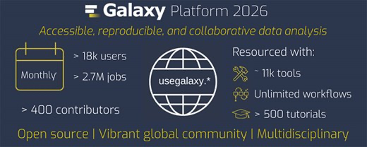

# Galaxy’s 2026 Update Published in Nucleic Acids Research

The latest update on the Galaxy platform has been published in Nucleic Acids Research.

*Galaxy for accessible, reproducible, and collaborative data analyses: 2026 update* highlights a major modernization of Galaxy and the continued growth of its global research and training community.

The update introduces a **redesigned and more responsive user interface**, including improved navigation, tool discovery, history management, and a centralized view for working with datasets. **Workflow development and execution have also been enhanced** with features such as workflow search, multi-step editing, undo and redo, Smart Sample Sheets, and a graph-based view for monitoring workflow runs.

Galaxy now offers more **flexible data management** through expanded dataset collections, temporary scratch storage, and connections to external repositories and storage services. A **modern visualization framework** also makes it easier to explore genomic, imaging, molecular, geospatial, and other research data directly within Galaxy.

Now in its third decade, **Galaxy supports more than 650,000 registered users**. Major public Galaxy servers process approximately **two million analysis jobs each month**, while the **Galaxy Training Network provides more than 500 free tutorials** across a growing range of scientific domains.

Read the full article to learn more about the features, infrastructure, and community supporting Galaxy’s continued development.

[**Read the Galaxy 2026 update**](https://doi.org/10.1093/nar/gkag469)

*A huge thank you to Scott Cain for his outstanding support in organizing the 2026 Galaxy Update paper.*