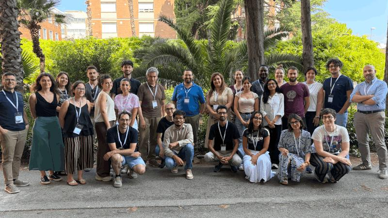
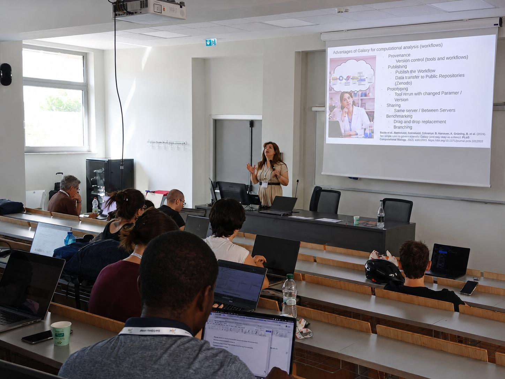
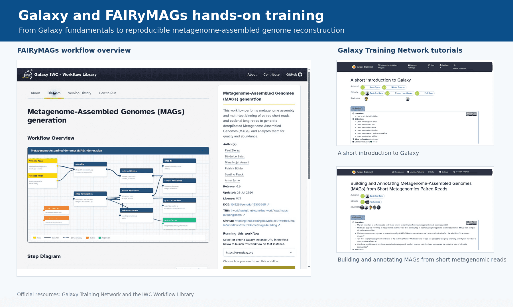

---
subsites:
- all
date: '2026-07-28'
title: Galaxy at the ELIXIR-Italy Microbiome Summer School in Bari
tags: [training, workshop, workflow, metagenomics]
tease: "Galaxy and FAIRyMAGs training at the ELIXIR-Italy summer school on targeted and shotgun metagenomics in Bari, Italy"
contributions:
  authorship:
    - minamehr
  funding:
    - uniba
    - elixir-it
    - bits
    - fem
    - uni-freiburg
    - elixir-europe
---

From 29 June to 3 July 2026, the summer school **"Profiling of microbial communities using targeted and shotgun metagenomics"** brought researchers together at the University of Bari Aldo Moro, Italy, for five days of lectures and practical training in microbiome data analysis.

Promoted by ELIXIR Italy and the Italian Society of Bioinformatics (BITS), with support from the University of Bari Aldo Moro and Fondazione Edmund Mach, the summer school covered DNA metabarcoding, shotgun metagenomics, machine learning, and microbial network analysis. The programme combined theoretical introductions with practical exercises designed to guide participants through different stages of microbial community analysis.

<small>Participants, instructors, and organizers on the final day of the summer school at the University of Bari Aldo Moro.</small>

## A dedicated Galaxy training day

The final day of the summer school was dedicated to the **Galaxy Project and usegalaxy.eu**. Mina Hojat Ansari, a member of the Freiburg Galaxy Team at the University of Freiburg, delivered the lecture and hands-on sessions.

The day began with an introduction to the Galaxy ecosystem and its central principles of accessible, reproducible, and transparent data analysis. Participants were introduced to the logic of Galaxy analyses, the role of histories and workflows, and the resources available through the Galaxy Training Network.

This was followed by the GTN hands-on tutorial [A short introduction to Galaxy](https://training.galaxyproject.org/training-material/topics/introduction/tutorials/galaxy-intro-short/tutorial.html). Through this practical session, participants became familiar with the Galaxy interface and learned how to work with histories, upload data, run tools, inspect results, and execute workflows.

<small>Mina Hojat Ansari from the Freiburg Galaxy Team introducing Galaxy and reproducible computational workflows.</small>

## Reconstructing microbial genomes with FAIRyMAGs

The introductory session provided the foundation for the main hands-on training: [Building and Annotating Metagenome-Assembled Genomes (MAGs) from Short Metagenomics Paired Reads](https://training.galaxyproject.org/training-material/topics/microbiome/tutorials/mags-building/tutorial.html).

Using training material developed through the **FAIRyMAGs project**, participants explored how Galaxy workflows can support the reconstruction and analysis of metagenome-assembled genomes. The tutorial introduced the principal stages of genome-resolved metagenomic analysis, including read quality control and preprocessing, assembly, binning, bin refinement, quality assessment, taxonomic assignment, and functional annotation.

<small>Galaxy and FAIRyMAGs resources highlighted during the hands-on training, including the Galaxy Training Network tutorials and the IWC workflow for metagenome-assembled genome generation.</small>

The session demonstrated how a complex, multi-step metagenomic analysis can be represented as a transparent, reproducible, and reusable Galaxy workflow. The FAIRyMAGs workflows are maintained through the [Intergalactic Workflow Commission](https://iwc.galaxyproject.org/) and can be shared and reused across Galaxy servers and research projects.

## Supporting reproducible microbiome research

By concluding the summer school with Galaxy, participants could connect the analytical concepts introduced during the preceding days with an accessible environment for executing, documenting, and reproducing computational analyses.

The training also highlighted the role of community-developed resources, including the [Galaxy Training Network](https://training.galaxyproject.org/), the [microGalaxy community](https://galaxyproject.org/community/sig/microbial/), and the [FAIRyMAGs project](https://elixir-europe.org/how-we-work/scientific-programme/science/bfsp/fairymags), in making sophisticated microbiome and genome-resolved metagenomic analyses more accessible to researchers with different levels of computational experience.

## Acknowledgements

We thank the summer-school organizers, Giuseppe Defazio, Claudio Donati, Bruno Fosso, and Monica Santamaria, as well as all speakers and instructors for developing a broad programme spanning microbiome sequencing, bioinformatics, machine learning, network analysis, and reproducible workflows.

Special thanks go to the students for their enthusiasm, active participation, and stimulating discussions throughout the course, and to the Department of Biosciences, Biotechnology and Environment at the University of Bari Aldo Moro for hosting the event.

The complete programme and course information are available on the [ELIXIR-Italy Training Platform](https://elixir-iib-training.github.io/site/2026-06-29-Profiling_microbial_communities), and the accompanying course resources are available through the [summer-school GitHub wiki](https://github.com/gdefazio/PMCUTSM-2026-BARI/wiki).
