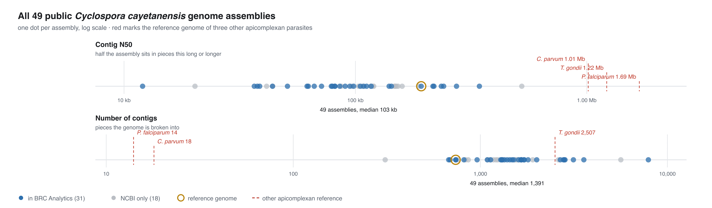
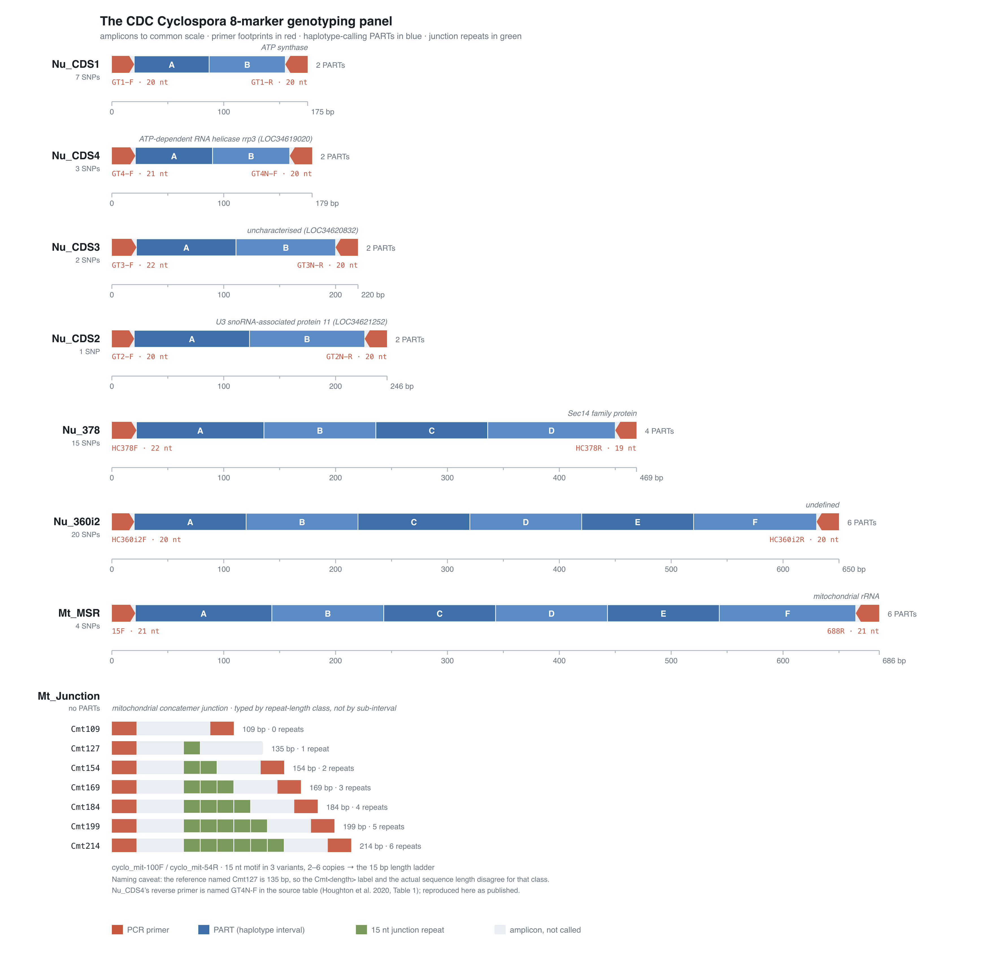
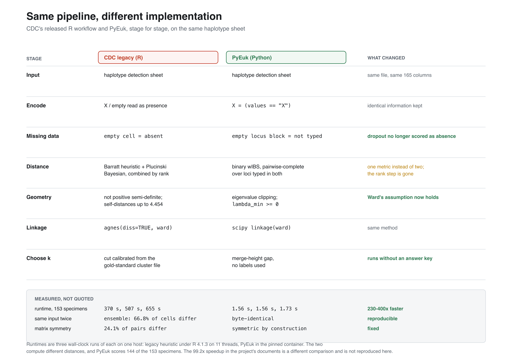
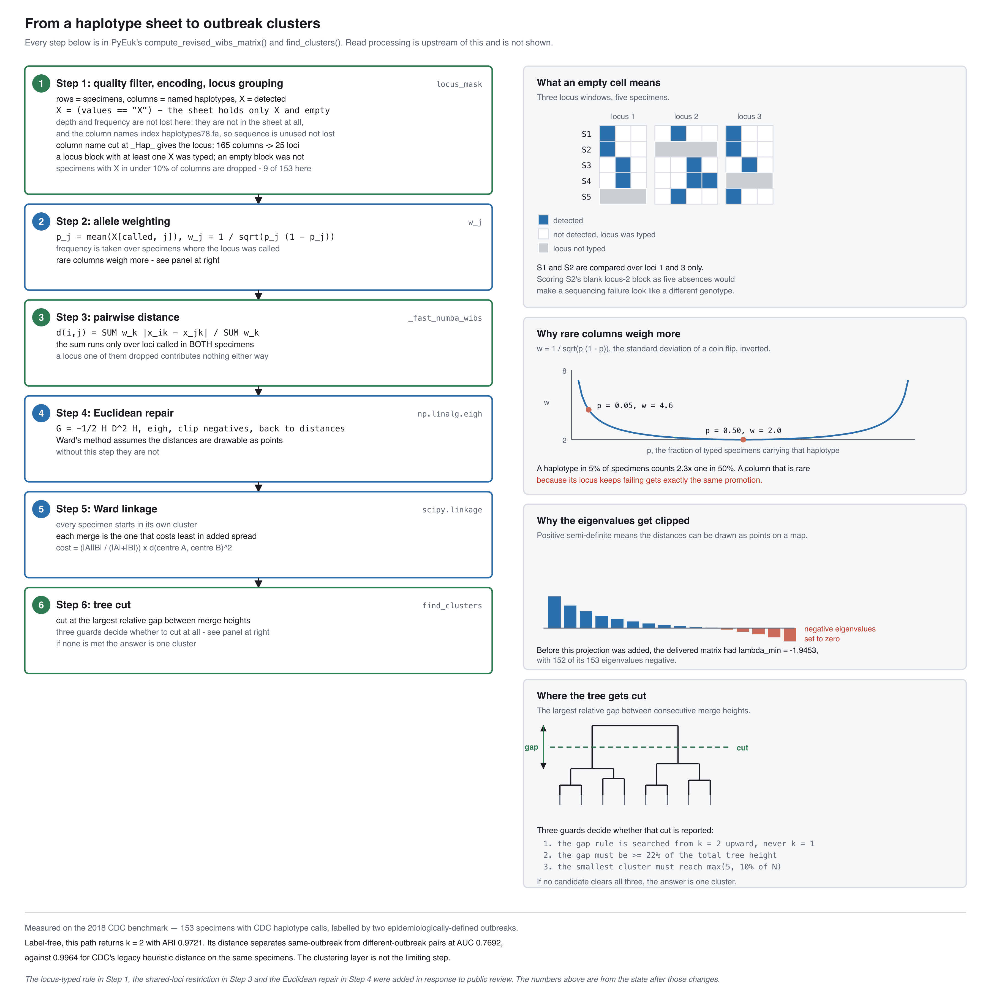

# Genotyping Cyclospora: assessing current practices

The 2026 cyclosporiasis season is the largest on record in the United States. CDC recorded 10,468 laboratory-confirmed domestically acquired cases between 1 May and 3 August 2026, with 517 hospitalisations, 2 deaths and 47 states reporting.

A [new post on the BRC Analytics blog](https://brc-analytics.org/learn/blog/genotyping-cyclospora-assessing-current-practices) opens a series on the analysis of *Cyclospora* outbreaks. It is the first post in a four-post series; parts 2 to 4, covering the tooling and the Galaxy workflow, are still to come. Some highlights from the series:

## *C. cayetanensis* assemblies are bad

Forty-nine *C. cayetanensis* assemblies are public. **None is chromosome-level**, two are annotated, and the median one is in 1,391 pieces.

This is why *Cyclospora* is typed from a small panel of amplicons rather than from genomes, and it is the starting point for the independent open implementation of the published eight-marker method that the series will build in Galaxy.

## Current typing is done by ampliconic sequencing

*Cyclospora* is typed from small panels of PCR amplicons. Four approaches appear in the public record: CDC's eight-marker panel (six nuclear, two mitochondrial), an FDA 52-locus assay sensitive enough for food rather than stool alone, an expanded 63-marker scheme with no published marker list, and mitochondrion-only typing. The eight-marker panel dominates — 8,522 of the 9,016 public amplicon runs used it, against 494 across the other three — and it is the only one with a published set of outbreak cluster labels to score a pipeline against. 

## Current tooling is suboptimal

The method works; the code that implements it does not. CDC's released R pipeline fails on three counts, all in the shipped source. It cannot run on any R ≥ 4.2, because `as.vector()` on a data frame changed behaviour at that release. `import_data_V2.r` stops with `subscript out of bounds` on CDC's own 203-specimen 2018 reference population — its specimen-retention filter hardcodes four marker names, and the same file's drop rule has just deleted one of them.

## We have a new approach: PyEuk

[PyEuk](https://github.com/spond/pyeuk) reimplements the distance and clustering steps in Python. It is Apache-2.0, installs with `pip` (and soon with BioConda), and depends only on NumPy, SciPy, pandas and scikit-learn. The path runs from multi-locus completeness filtering and binary encoding through population-genetics allele weighting, high-speed parallel KING-wIBS pairwise distance, a Euclidean metric repair, deterministic Ward linkage, and dynamic tree cutting. On the same 153-specimen sheet and the same host, the legacy heuristic under R 4.1.3 took 370, 507 and 655 seconds across three runs; PyEuk in a pinned container took 1.56, 1.56 and 1.73 — between 230× and 400× faster. 

## And it is coming to Galaxy

It is now a Galaxy workflow.

All of this is coming to BRC-analytics, IUC, IWC, and GTN.
