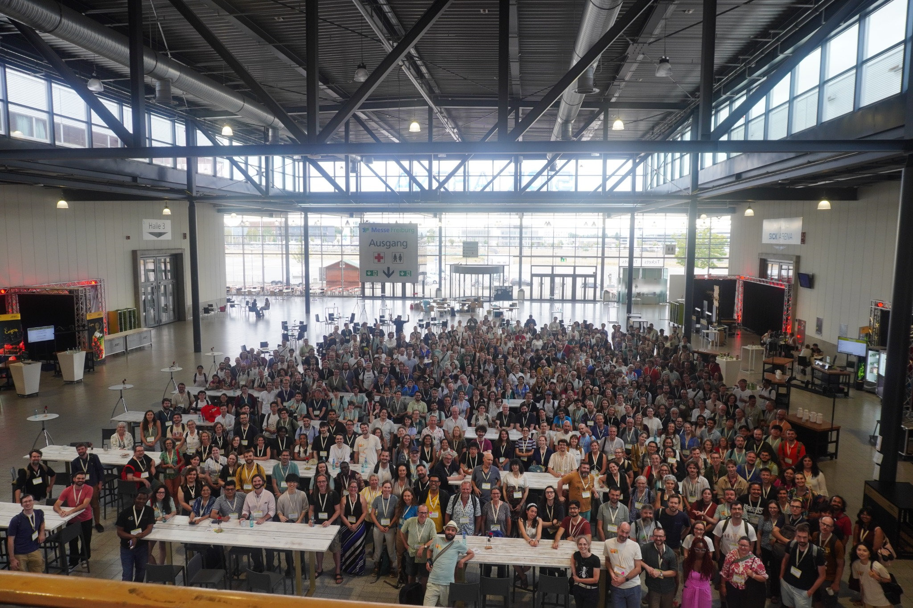
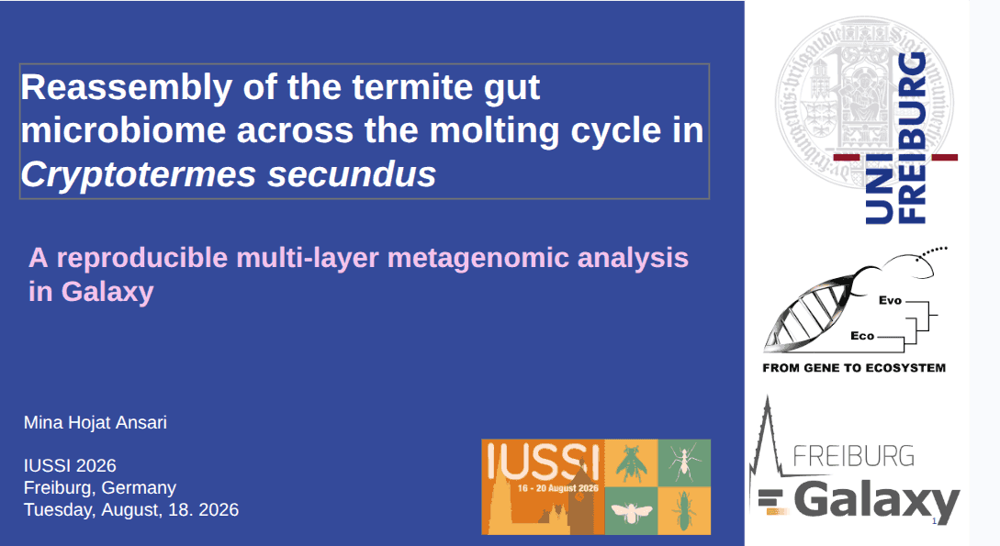

---
subsites:
- all
date: '2026-09-08'
title: Galaxy at the International IUSSI Congress 2026 — Exploring termite gut microbiome recovery
tags: [conference, metagenomics, workflow]
tease: "At IUSSI 2026 in Freiburg, Mina Hojat Ansari presented how reproducible, multi-layer metagenomic analysis in Galaxy helps investigate termite gut microbiome recovery after molting."
contributions:
  authorship:
    - minamehr
  funding:
    - uni-freiburg
---
From **16 to 20 August 2026**, Freiburg, Germany, hosted the [**20th International Congress of the International Union for the Study of Social Insects (IUSSI)**](https://iussi2026.org/). Continuing a [tradition spanning more than seven decades](https://www.socialinsects.org/history), the congress brought together researchers from around the world to explore the biology of ants, bees, wasps, and termites, from the molecular mechanisms underlying individual behaviour to the organization of entire colonies. Its [scientific symposia](https://iussi2026.org/scientific-symposia/) covered social evolution, division of labour, communication, cognition, genomics, conservation, and host–microbe interactions, reflecting the breadth of approaches used to understand insect societies.

<small>Participants at the 20th International Congress of IUSSI, held in Freiburg, Germany, from 16 to 20 August 2026.</small>

**Mina Hojat Ansari**, from the **Freiburg Galaxy Team** at the University of Freiburg, presented “[Reassembly of the termite gut microbiome across the molting cycle in *Cryptotermes secundus*](https://iussi2026.org/wp-content/uploads/2026/08/iussi2026-abstract-book.pdf#page=570)” on **18 August**, in the symposium on host–microbe interactions in social insects. Her talk explored how reproducible metagenomic analysis in Galaxy can help us understand how termite gut microbial communities recover after molting.

## How does a termite rebuild its gut microbiome?

Termites depend on their gut microbial partners to help digest wood. Molting disrupts this partnership, and social interactions offer a route to restoring it: nestmates can transfer gut microorganisms through the exchange of hindgut contents, a behaviour known as **proctodeal trophallaxis**.

The study investigates this process in the wood-dwelling termite *Cryptotermes secundus*, using worker gut metagenomes collected at different stages after molting. Which microorganisms remain detectable immediately after the molt? How does the community change as recovery progresses? And how are these changes reflected in its functional potential?

## Connecting the biological question with Galaxy workflows

The presentation highlighted how [**Galaxy Europe**](https://usegalaxy.eu/) brings together complementary approaches to investigate microbiome reassembly. Read-based profiling examines the microbial composition of each sample, while genome-resolved analysis reconstructs microbial genomes to explore the organisms present and their functional potential.

The genome-resolved analysis builds on [**FAIRyMAGs**](https://elixir-europe.org/how-we-work/scientific-programme/science/bfsp/fairymags), using reusable workflows for metagenomic assembly, binning, genome quality assessment, taxonomic classification, and functional annotation. Analyses of viruses and microbial eukaryotes extend the investigation beyond the bacterial community.

Galaxy connects these analyses within a shared computational environment. Its histories record the tools, versions, and parameters used, while workflows make it possible to apply the same analytical steps consistently across samples. This supports reproducibility as the project develops and provides a foundation for sharing and adapting the analyses to other host-associated microbiomes.

<small>Investigating termite gut microbiome reassembly through reproducible, multi-layer metagenomic analysis in Galaxy.</small>

## Bringing reproducible metagenomics to social-insect research

IUSSI brought this work to an audience united by an interest in social insects, spanning fields from behaviour and ecology to genomics. Presenting a Galaxy-based approach in this setting connected a biological question—how microbial partnerships are re-established after molting—with computational resources that other researchers can use and adapt.

For researchers interested in exploring these approaches, the [Galaxy Training Network tutorial on building and annotating metagenome-assembled genomes](https://training.galaxyproject.org/training-material/topics/microbiome/tutorials/mags-building/tutorial.html) offers a practical starting point. Reusable workflows are available through the [Intergalactic Workflow Commission](https://iwc.galaxyproject.org/), while the [**microGalaxy community**](https://galaxyproject.org/community/sig/microbial/) connects researchers and developers working on microbial data analysis in Galaxy.

## Acknowledgements

We thank the IUSSI 2026 congress and symposium organizers for the opportunity to present this research. We gratefully acknowledge **Judith Korb** for her collaboration on the termite microbiome project, and the **European Galaxy Team**, **FAIRyMAGs contributors**, and the wider Galaxy community for developing and maintaining the infrastructure and workflows supporting the analyses.
