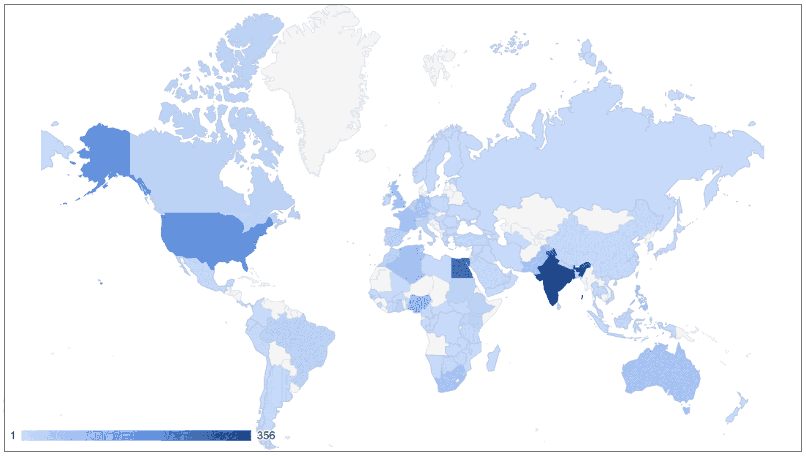
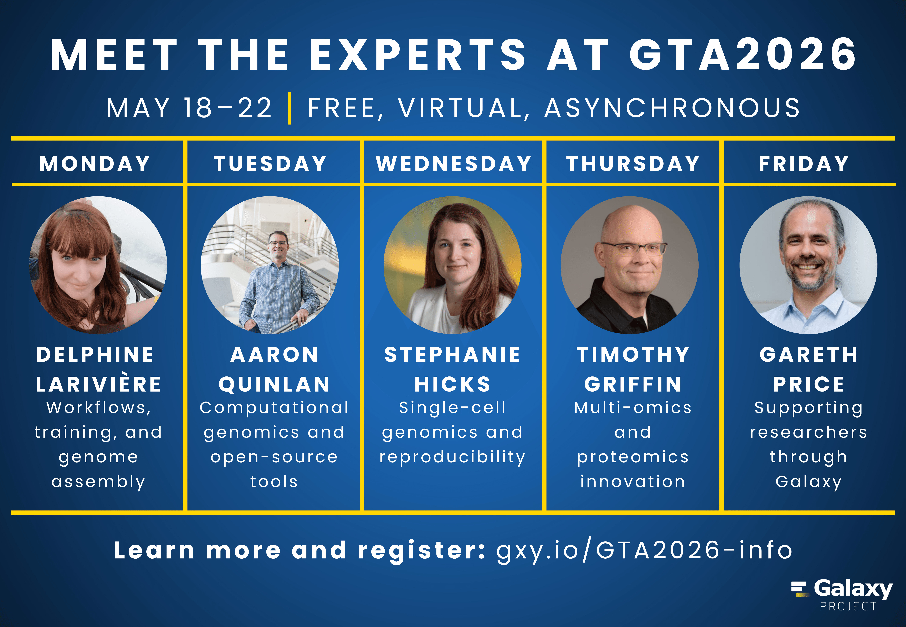

# Galaxy Training Academy 2026: A Global Week of Learning

From May 18–22, 2026, the **Galaxy Training Academy (GTA)** brought learners, trainers, developers, and researchers from around the world together for a week of free and accessible online training.

GTA2026 received **more than 2,200 registrations from 108 countries**, highlighting the truly global reach of the Galaxy community. Participants could choose from **11 training tracks**, explore hands-on tutorials, work directly in Galaxy, and learn at their own pace throughout the week.

The reach of GTA2026 reflects one of the core goals of the GTA: making high-quality computational training available to researchers wherever they are, regardless of location, time zone, institution, or previous experience with Galaxy.

## Eleven Tracks, One Global Classroom

GTA2026 was designed as an asynchronous training event, allowing participants to build a schedule that worked for them rather than requiring everyone to attend live sessions at the same time.

The GTA began with an introduction to Galaxy before learners moved into specialized training tracks covering:

- Assembly
- Climate
- Digital Humanities
- Ecology
- From Zero to Hero with Python
- Machine Learning
- Microbiome
- Proteomics
- Single Cell
- Transcriptomics
- Variant Analysis

At the heart of each track were the open, hands-on training materials created and maintained by the **[Galaxy Training Network](https://training.galaxyproject.org/)**.

Participants could work through tutorials, watch instructional videos, analyze data in Galaxy, and ask questions throughout the week. Trainers and volunteers from across the Galaxy community helped provide support across time zones, giving learners the flexibility of asynchronous training while still having a community available when they needed help.

## Meet the Experts

A highlight of GTA2026 was the **Meet the Experts** series, which gave participants a chance to hear directly from researchers and Galaxy community members working in fields represented throughout the GTA.

Throughout the week, participants met:

- **Delphine Larivière**, discussing genome assembly and the Galaxy community
- **Aaron Quinlan**, discussing computational genomics and genomic variation
- **Stephanie Hicks**, discussing single-cell and spatial transcriptomics
- **Timothy Griffin**, discussing proteomics and Galaxy-P
- **Gareth Price**, discussing Galaxy Australia and accessible bioinformatics infrastructure

The series provided a look beyond individual tutorials and tools, connecting GTA participants with the people, research questions, and communities behind the training.

A special thank you goes to **Mike Schatz** for his help in making the Meet the Experts series possible, and to each of our featured experts for taking the time to share their experiences with the GTA community.

The Meet the Experts videos remain available after the GTA, allowing learners to revisit the conversations and continue exploring the people and research behind Galaxy.

[Watch the GTA2026 Meet the Experts series on YouTube](https://youtube.com/playlist?list=PLNFLKDpdM3B97hDDDWytOj1Pj37XxEBed&si=QyoOQGX17DpG9Lq9)

## Built on the Galaxy Training Network

Although the Galaxy Training Academy takes place during one week, the resources that make it possible are available all year.

The **Galaxy Training Network (GTN)** provides the open, community-developed tutorials that form the foundation of GTA. These materials can be used freely by individual learners, instructors, workshops, and institutions around the world.

GTA builds on that foundation by bringing tutorials together into structured learning paths and surrounding them with additional support from the Galaxy community.

Behind the scenes, the GTA is a broad collaborative effort. Track leads organize learning pathways, instructors create and maintain tutorials, reviewers test training materials, Galaxy administrators prepare infrastructure, volunteers support participants, and community members contribute to communications, registration, video production, certificates, and event coordination.

GTA2026 would not have been possible without that collective effort.

## Thank You, GTA2026!

The numbers tell an exciting story: more than 2,200 registrations, 108 countries, and 11 training tracks. But the Galaxy Training Academy is ultimately about the people behind those numbers.

Thank you to everyone who joined GTA2026, worked through a tutorial, tried something new in Galaxy, asked a question, helped another learner, or shared the GTA with their community.

And thank you to the instructors, track leads, tutorial contributors, reviewers, support volunteers, developers, Galaxy administrators, infrastructure teams, organizers, and community members whose work made the event possible.

The GTA may have lasted five days, but the learning does not stop there. The tutorials and training resources developed through the Galaxy Training Network remain freely available for anyone who wants to continue learning, teaching, or exploring Galaxy.

We look forward to seeing where the GTA community goes next.