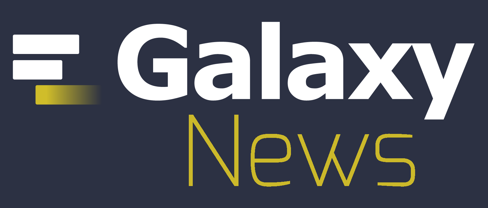
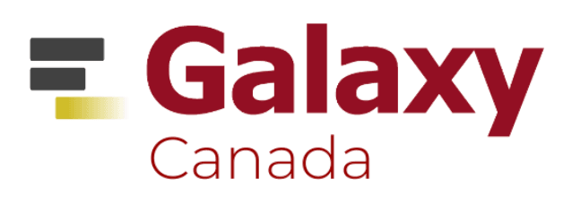
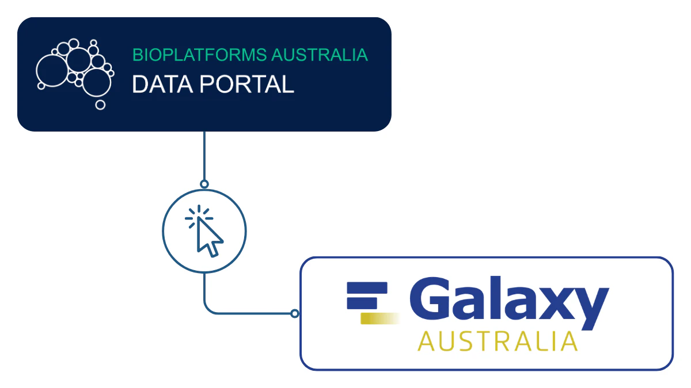
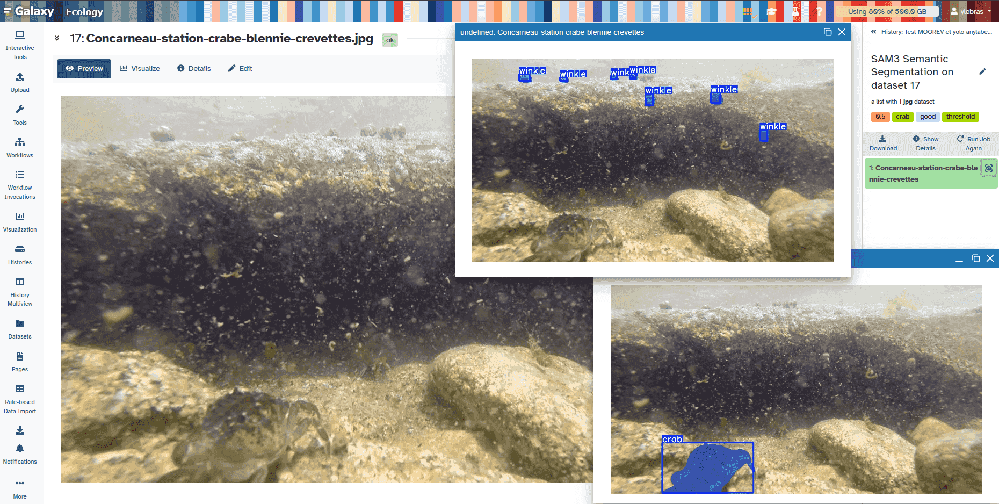
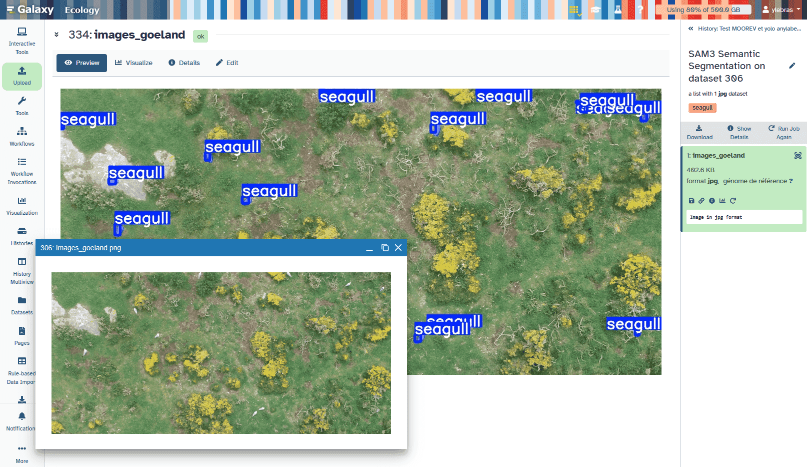
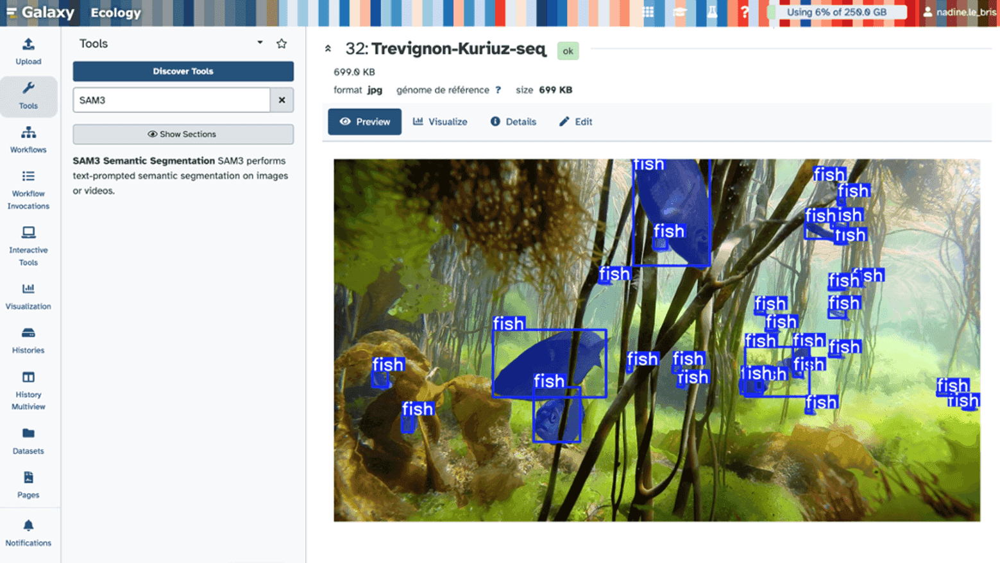
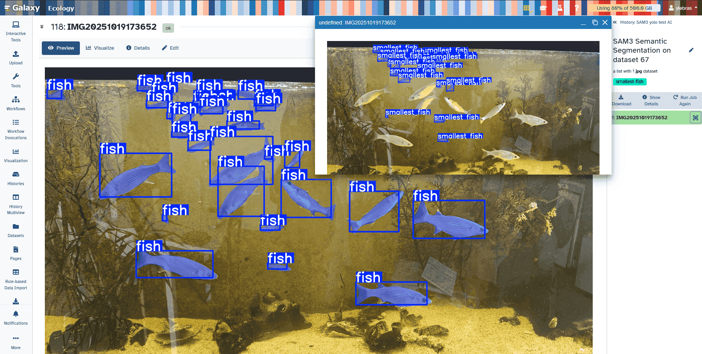

# September 2026

Hello Galaxy Community,

The third quarter of 2026 has brought new ways to work, document, connect, and collaborate across the Galaxy ecosystem. In this issue, we explore the newest features in **Galaxy 26.1**, including Galaxy Notebooks, context-aware GalaxyAI agents, Model Context Protocol support, improved workflow tools, and more personalized access to frequently used tools. We also highlight **Galaxy Labs**, a community-driven approach to building reusable, domain-specific entry points that help researchers find the tools, workflows, and training resources most relevant to their work.

We also celebrate an exciting expansion of the international Galaxy community as **UseGalaxy Canada joins the UseGalaxy.\* federation**, with another Canadian milestone already on the horizon: **GCC2027 in Montréal**. In Australia, a new connection between the Bioplatforms Australia Data Portal and Galaxy Australia is making it dramatically easier to move large research datasets directly into an analysis-ready Galaxy history. Beyond platform and community updates, we look at how Galaxy is supporting AI-enabled wildlife ecology and open, reproducible approaches to *Cyclospora* outbreak analysis.

Finally, we highlight two opportunities to join the Galaxy ecosystem and share upcoming training, workshops, conferences, and community events.

---

# Galaxy 26.1: Connected, Contextual, and Reproducible Research

Galaxy 26.1 introduces new ways to document analyses, receive context-aware assistance, connect Galaxy with external tools, manage data at scale, and move more efficiently between histories, workflows, and frequently used tools.

## Galaxy Notebooks: Turn a History into a Living Scientific Record

Galaxy Notebooks bring narrative, datasets, visualizations, and analysis context together in one collaborative workspace. Researchers can document decisions while they work, connect written interpretation directly to Galaxy data, and build reproducible reports that remain tied to the analyses they describe.

GalaxyAI is also integrated directly into notebooks, where it can use the notebook's own context to help draft and propose content without separating documentation from the analysis itself.

<iframe width="560" height="315" src="https://www.youtube.com/embed/B7rQQ-4kjAk" title="Galaxy 26.1 - Galaxy Notebooks" frameborder="0" allow="accelerometer; autoplay; clipboard-write; encrypted-media; gyroscope; picture-in-picture; web-share" referrerpolicy="strict-origin-when-cross-origin" allowfullscreen></iframe>

## GalaxyAI Gets More Context-Aware

GalaxyAI continues to evolve in 26.1 with a dockable assistant that understands where a user is working in Galaxy. Depending on the current context, GalaxyAI can route questions to specialized agents for tasks such as error analysis, tool recommendations, Galaxy Training Network tutorials, and Intergalactic Workflow Commission workflows.

The new system is designed to ask for clarification when a request is ambiguous rather than guessing, and responses identify which specialized agent produced the answer. GalaxyAI can also help draft reports from workflow invocations and support safer custom-tool creation by resolving verified containers.

## Connect External AI Tools with Galaxy through MCP

Galaxy 26.1 adds support for the **Model Context Protocol (MCP)**, creating a standardized way for compatible AI clients outside the Galaxy interface to interact with Galaxy services.

When enabled by a Galaxy administrator, MCP-compatible clients can search and run tools, inspect histories and datasets, invoke workflows, monitor jobs, and discover community workflows. These interactions go through Galaxy's existing service layer, preserving the same authorization and validation used by other Galaxy clients.

## A Modern Workflow Extraction Experience

Turning a successful history into a reusable workflow is now clearer and more intuitive. The history-to-workflow extraction interface has been rebuilt with a modern card-based design that distinguishes tool steps from workflow inputs and allows users to rename inputs before creating the workflow.

Users can also open related jobs directly from the extraction view and see the newly created workflow immediately after extraction finishes.

<iframe width="560" height="315" src="https://www.youtube.com/embed/NFUxEZeBnlw" title="Galaxy 26.1 - Modern Workflow Extraction Interface" frameborder="0" allow="accelerometer; autoplay; clipboard-write; encrypted-media; gyroscope; picture-in-picture; web-share" referrerpolicy="strict-origin-when-cross-origin" allowfullscreen></iframe>

## Favorite and Recent Tools, Right Where You Need Them

Galaxy 26.1 introduces an optional tool panel designed to make everyday work faster. Users can keep favorite tools close at hand, automatically see recently executed tools, search directly within the panel, and use keyboard navigation to move through their personalized tool list.

For users who have not yet selected favorites, the interface also helps guide tool discovery and organization.

<iframe width="560" height="315" src="https://www.youtube.com/embed/LWiEQpuNJFY" title="Galaxy 26.1 - Favorite and Recent Tools Panel" frameborder="0" allow="accelerometer; autoplay; clipboard-write; encrypted-media; gyroscope; picture-in-picture; web-share" referrerpolicy="strict-origin-when-cross-origin" allowfullscreen></iframe>

## More Improvements Across Galaxy

Galaxy 26.1 also includes improvements for working with data and monitoring workflows at scale:

- **Bulk dataset storage migration** makes it possible to move multiple datasets and collections between storage locations, preview changes before migration, monitor progress, and receive optional completion notifications.
- **Workflow execution monitoring** now allows users to inspect the full configuration of a workflow step directly from the invocation graph without returning to the workflow editor.
- Updates across Galaxy's visualizations, datatypes, and built-in tools continue to improve day-to-day analysis and platform reliability.

[**Explore the Galaxy 26.1 user release notes**](https://docs.galaxyproject.org/en/release_26.1/releases/26.1_announce_user.html)

---

# Galaxy Labs: Community-Curated Interfaces, Built to Travel

Galaxy's breadth is one of its greatest strengths, but thousands of available tools, workflows, and training resources can also make it difficult for researchers to know where to begin. **Galaxy Labs** are designed to provide a more focused entry point: community-curated Galaxy interfaces built around a particular research domain and the resources that community recommends.

Earlier Galaxy **Flavours** demonstrated the value of domain-specific Galaxy subdomains, but they were often static and server-specific. Maintaining the same community interface across multiple Galaxy servers could mean recreating and updating it in several places. The **Galaxy Labs Engine (GLE)** evolves that model by separating community content from deployment. A research community can maintain a shared, authoritative collection of content while individual Galaxy servers reuse it and add local context such as branding, support information, or other server-specific details.

For researchers, a Galaxy Lab acts as a more approachable gateway into a research area. Labs can surface relevant **tools, workflows, tutorials, videos, and other community resources** in a structured interface rather than asking users to navigate the full Galaxy ecosystem on their own. The goal is especially useful for researchers who are new to Galaxy or to a particular analytical domain, while still providing a curated resource hub for experienced users.

For the communities maintaining those resources, the model reduces duplicated effort. Lab content is open, reusable, and version-controlled, and updates to shared content can be reflected across participating Galaxy services instead of being rebuilt independently. The design is explicitly centered on **FAIR principles: Findable, Accessible, Interoperable, and Reusable**.

The Galaxy Labs approach is already supporting active communities. The **Genome Lab** served as the inaugural Galaxy Lab, while the **Single-Cell Lab** brought together work from the international Single-Cell and Spatial Omics Community. The **Microbiology Lab** demonstrates how the same community-curated content can be deployed across multiple public Galaxy servers while maintaining a consistent user experience.

The work behind Galaxy Labs was published this year in *GigaScience* in **“Community-curated Galaxy interfaces with the Galaxy Labs Engine.”** The Galaxy Training Network also shared a community reflection on the project and the international collaboration that helped turn the idea into reusable infrastructure.

[**Read the Galaxy Labs GTN highlight**](https://training.galaxyproject.org/training-material/news/2026/06/16/galaxy_labs.html)

[**Read the Galaxy Labs Engine paper in GigaScience**](https://academic.oup.com/gigascience/article/doi/10.1093/gigascience/giag041/8644284)

[**Explore the Galaxy Labs Engine**](https://labs.usegalaxy.org.au/)

---

# A New Star in the Galaxy: Welcome, UseGalaxy Canada!

  

The international UseGalaxy.\* community has a new member. **UseGalaxy Canada (UseGalaxy.ca) has formally joined the UseGalaxy.\* federation**, expanding the network of large public Galaxy services that provide researchers with access to shared tools, reference data, workflows, training resources, and computational infrastructure.

UseGalaxy Canada launched in 2024 and has spent the past two years scaling its production infrastructure and technical team. The service provides free public access to Galaxy using Canadian cloud and Advanced Research Computing resources, while remaining available to researchers and collaborators internationally.

Like other members of the UseGalaxy.\* federation, UseGalaxy Canada is working toward a consistent user experience built around shared infrastructure, community tools, reference data, and reproducible analysis. The service also maintains tools, workflows, and reference datasets in response to the needs of the Canadian research community.

The formal integration was highlighted at GCC2026 in Clermont-Ferrand with **“A New Star in the Galaxy: Canada is Joining the UseGalaxy.\* International Federation,”** marking an exciting new chapter for Galaxy's global public infrastructure.

[**Launch UseGalaxy Canada**](https://usegalaxy.ca/)

[**Learn more about UseGalaxy Canada in the Research Software Directory**](https://research-software-directory.org/software/usegalaxy-canada)

**Next stop: Montréal!** The Galaxy Community Conference is heading to Canada for **GCC2027 in Montréal**. More details will follow as planning gets underway, but we are already looking forward to bringing the Galaxy community together again next year.

---

# From Data Portal to Galaxy Australia in One Click

  

*Image credit: Australian BioCommons / Bioplatforms Australia, CC BY 4.0.*

Moving data between services is an unavoidable part of many research workflows, but it can quickly become a bottleneck when researchers have to download files, move them manually, or copy and paste long lists of URLs before analysis can even begin. A new integration from **Australian BioCommons** is making that process much simpler for users of the **Bioplatforms Australia Data Portal** and **Galaxy Australia**.

Researchers can now select data in the Bioplatforms Data Portal and choose **“Send to Galaxy.”** The transfer happens automatically in the background, and the selected data appear directly in the user's Galaxy history, ready for analysis. That means less time spent acting as the connection between separate research services and more time working with the data themselves.

The integration is particularly powerful because the Bioplatforms Data Portal hosts **more than 400 TB of reference molecular life-sciences data** spanning agriculture, biomedicine, environmental research, and industry. Projects such as the **Australian Fish Genomics Initiative**, which brings together genomics, genetics, and transcriptomics data from 56 partner projects, can now move large datasets into Galaxy Australia without requiring researchers to first download the data locally.

The new connection is enabled by **BioCommons Access**, a shared single sign-on system designed to make it easier to securely find, analyze, and move biological data across Australian BioCommons services. More than 3,100 existing Galaxy Australia and Bioplatforms Data Portal users have already been migrated to the system, with nearly 4,000 new accounts created since March 2026.

This is a great example of what interoperable research infrastructure can look like in practice: data, compute, and analysis services connected so researchers can move directly from finding a dataset to working with it in Galaxy.

[**Read the Australian BioCommons announcement**](https://www.biocommons.org.au/news/biocommons-access-data-transfer)

[**Explore Galaxy Australia**](https://usegalaxy.org.au/)

---

# Galaxy in Research: AI Meets Wildlife Ecology

Galaxy is often associated with genomics and bioinformatics, but the ecosystem continues to grow far beyond sequence analysis. One especially visual example comes from the **MOOREV citizen science project**, where Galaxy Ecology and Galaxy Imaging resources are being used to support marine biodiversity research with underwater imagery and artificial intelligence.

Led by Nadine Le Bris at Sorbonne Université's marine station in Concarneau, France, MOOREV studies how local microclimates and climate disturbances affect seashore biodiversity and species interactions. The project combines research with citizen science, working with educators, students, and local communities to collect observations across shoreline habitats over time.

Galaxy provides a shared environment where the project can connect data, tools, workflows, and training resources while keeping analyses reusable and accessible. Rather than building an entirely new computational platform, the MOOREV team has been able to build on work already developed by the Galaxy Ecology, Galaxy Imaging, and UseGalaxy.eu communities.

Two AI approaches are playing a particularly important role. Updated **YOLO** tools support object detection workflows and user-provided models, while a Galaxy implementation of **Segment Anything Model 3 (SAM3)** can identify, segment, or track features in images and video using text prompts.

For MOOREV, these capabilities have been tested on real biodiversity imagery, including crabs, winkles, fish, and birds. The examples show how Galaxy can make increasingly sophisticated imaging and AI methods available through the same reproducible environment used across many other research domains.

  
  
  
  

*Examples of SAM3 applied to biodiversity imagery in Galaxy, including MOOREV underwater images and bird and fish detection examples.*

The project is also a good example of how Galaxy communities build on one another. Imaging tools developed for one research context can become reusable infrastructure for ecology, citizen science, education, and conservation research, while improvements made for MOOREV can flow back into the wider Galaxy ecosystem.

[**Read the full AI for wildlife and ecology story**](https://galaxyproject.org/news/2026-03-20-ecology-ai-imaging/)

[**Explore Galaxy Ecology**](https://ecology.usegalaxy.eu/)

---

# From Genomes to Outbreaks: Reproducible *Cyclospora* Analysis in Galaxy

A new BRC Analytics series is taking a close look at how *Cyclospora cayetanensis* outbreaks are genotyped and how those analyses can be made more open, reproducible, and accessible through Galaxy.

The first installment examines the current state of public *C. cayetanensis* genome assemblies, the marker panels used for genotyping, available sequencing data, and limitations in existing analysis software. Because public genome resources remain fragmented, current outbreak typing relies heavily on targeted amplicon panels rather than complete genome comparisons.

The work also introduces **PyEuk**, an open Python implementation of the distance and clustering steps used in *Cyclospora* genotyping. The goal is not simply to reproduce an existing method, but to create a transparent implementation that can be independently tested, maintained, and integrated into reusable analysis infrastructure.

That implementation is now being developed as a **Galaxy workflow**, bringing the analysis into an environment where inputs, parameters, intermediate steps, and results can be captured and shared. The workflow is intended to connect with BRC Analytics, the Intergalactic Utilities Commission, the Intergalactic Workflow Commission, and Galaxy Training Network resources as the project develops.

This work illustrates an important role for Galaxy in public-health bioinformatics: turning specialized analytical methods into transparent, reusable workflows that can be inspected, tested, taught, and improved by a broader community.

[**Read “Genotyping Cyclospora: assessing current practices”**](https://galaxyproject.org/news/2026-08-14-genotyping-cyclospora/)

---

# Galactic Career Center: Two Opportunities at the Earlham Institute

The Galaxy ecosystem is hiring. The Earlham Institute in Norwich, United Kingdom, currently has two open positions supporting the **BioFAIR Methods Commons** project.

## Galaxy Workflow Expert

The Galaxy Workflow Expert will support Galaxy users through workflow curation, training, and the Methods Commons Concierge Service, while also contributing to work on tool energy use and runtime optimization through ESG4Stars.

- **Location:** Norwich, United Kingdom
- **Contract:** 24 months, full time
- **Salary:** £38,000–£46,500 per year
- **Application deadline:** **17 September 2026**

[**View the Galaxy Workflow Expert position**](https://www.earlham.ac.uk/vacancy/galaxy-workflow-expert)

## DevOps Engineer, BioFAIR Methods Commons

The DevOps Engineer will help deploy, maintain, and integrate a production-grade UK Galaxy service on AWS. The role includes cloud infrastructure, automated CI/CD, API development, and production service observability.

- **Location:** Norwich, United Kingdom
- **Contract:** 24 months, full time
- **Salary:** £47,450–£52,560 per year
- **Application deadline:** **22 September 2026**

[**View the DevOps Engineer position**](https://www.earlham.ac.uk/vacancy/devops-engineer-biofair-methods-commons)

---

# Upcoming Training and Events

There are plenty of opportunities to learn, connect, and contribute across the Galaxy community in the coming months.

| Date | Event | Venue / Location |
| --- | --- | --- |
| 16–18 September 2026 | [IBSB 2026: Bioimage Analysis with Galaxy](https://galaxyproject.org/events/2026-09-17-ibsb2026/) | Jena, Germany |
| 23–25 September 2026 | [Gateways 2026](https://sciencegateways.org/gateways2026) | Washington, DC, USA |
| 5–6 October 2026 | [ESG4Stars Kick-off Meeting](https://galaxyproject.org/events/2026-10-05-esg4stars-kickoff/) | Freiburg, Germany |
| 7–9 October 2026 | [2nd Galaxy Tool Development Workshop](https://galaxyproject.org/events/2026-10-07-tool-dev-workshop/) | Freiburg, Germany |
| 11–14 October 2026 | [ASM Conference on Rapid Applied Microbial NGS and Bioinformatic Pipelines](https://galaxyproject.org/events/2026-10-11-asm-ngs-conference/) | Washington, DC, USA |
| 12–16 October 2026 | [Galaxy Beyond Basics: Mastering Workflows, Automation, and Scalability](https://training.galaxyproject.org/training-material/events/2026-10-12-Advanced-Galaxy-Training.html) | Paris, France |
| 4–7 November 2026 | [Biological Data Science 2026](https://meetings.cshl.edu/meetings.aspx?meet=DATA) | Cold Spring Harbor, New York, USA |

Looking for more opportunities? Galaxy and the Galaxy Training Network maintain continuously updated event listings for workshops, conferences, community meetings, and hands-on training around the world.

[**Browse upcoming Galaxy events**](https://galaxyproject.org/events/)

[**Browse upcoming GTN training events**](https://training.galaxyproject.org/training-material/events/index.html)

---

*Thank you for being a part of the Galaxy Community!*

**Stay updated with the latest news by following us on [Mastodon](https://mastodon.social/@galaxyproject@mstdn.science), [Bluesky](https://bsky.app/profile/galaxyproject.bsky.social), and [LinkedIn](https://www.linkedin.com/company/galaxy-project)!**