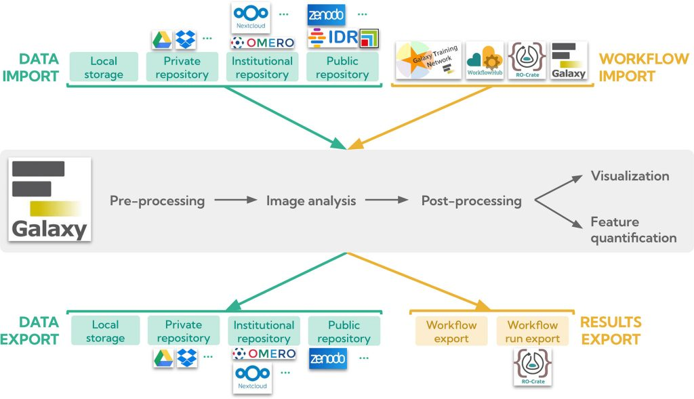

We're thrilled to share our new publication in *Journal of Microscopy*:
**"Bioimage management and analysis in Galaxy: Tools, workflows, training, and community practices."**
📘 [Read the full article here](https://doi.org/10.1111/jmi.70165)

## Bringing FAIR Principles to Bioimage Analysis

Image analysis in the life sciences is held back by fragmented software ecosystems, heterogeneous data formats, and limited reproducibility. These are barriers that make it hard to reuse methods and sustain tools over time. In this article, we describe how the **Galaxy platform** enables **FAIR (Findable, Accessible, Interoperable, and Reusable) image analysis** by providing an integrated environment for data access, workflow execution, provenance tracing, and training, all without requiring programming expertise.

We present Galaxy as a computational workbench that:
- Connects to **public, institutional, and private data repositories** (OMERO, Zenodo, IDR, BIA, cloud storage, and more), and supports modern formats such as **OME-Zarr** for efficient access to large, multi-dimensional datasets.
- Enables **human-in-the-loop workflows**, combining automated tools with interactive applications like CellProfiler, QuPath, ilastik, napari, and Vitessce for validation and annotation.
- Offers a **reference structure for FAIR image analysis workflows**: pre-processing, image analysis, post-processing/visualisation, and feature quantification. This structure supports modularity, interoperability, and reuse across imaging modalities.
- Ensures **reproducibility and provenance** through persistent histories, RO-Crate exports, semantic annotation with EDAM/bio.tools, and content-based fingerprinting with ISCC-SUM.
- Scales analyses on **HPC infrastructure** via free public Galaxy servers, without users needing to manage compute resources themselves.

## A Growing, Community-Driven Ecosystem

Beyond the technical foundations, the paper documents how sustainability in Galaxy comes from its community: developers, image analysts, trainers, and facility staff contributing tools, workflows, and training materials that benefit every Galaxy server worldwide.

Some highlights from our impact assessment:
- Nearly **200 image analysis tools** are now available in Galaxy, developed across several actively maintained GitHub repositories.
- Over **600 registered users running image analysis tools** on the European Galaxy server, with steadily growing adoption and tool usage since 2022.
- A continuously expanding set of **tutorials and workflows** on the [Galaxy Training Network](https://training.galaxyproject.org/training-material/topics/imaging), maintained collaboratively and automatically linked to [WorkflowHub](https://workflowhub.eu/) for citable, versioned reuse.
- Community efforts coordinated through the **FAIR Image Data Workflows Expert Group**, BioHackathons, and dedicated hackathons, connecting Galaxy with initiatives like EDAM, BIA, OME, BIOMERO, and Fractal.

## Looking Ahead

The article also outlines a roadmap for the future of bioimage analysis in Galaxy, including expanded native support for **OME-Zarr** and the **SpatialData** framework, tighter integration with research data management systems such as the BioImage Archive, and cross-disciplinary exploration of image analysis workflows beyond the life sciences through projects like [FIESTA-OSCARS](https://oscars-project.eu/projects/fair-image-analysis-across-sciences).

## Join the Community

You can explore tools and training resources at:
- [Galaxy Training Network – Imaging](https://training.galaxyproject.org/training-material/topics/imaging)
- [Galaxy Community Hub – Image Analysis](https://galaxyproject.org/community/sig/image-analysis)
- [FAIR Image Data Workflows Expert Group](https://www.eurobioimaging.eu/expert-groups/fair-image-data-workflows-expert-group)
- [French Galaxy Imaging Lab](https://imaging.usegalaxy.fr)

Interested in contributing? Join our community meetings, share your workflows and tools, and take part in upcoming trainings and hackathons.

---

🔬 *This work represents a collective achievement of the Galaxy Image Analysis community, highlighting open science, reproducibility, and collaboration across the bioimaging field.*
