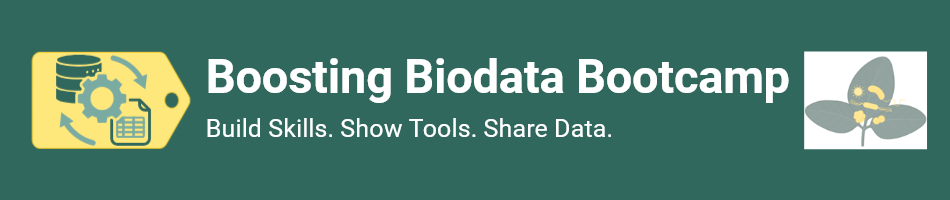

---
subsites:
- all-eu
title: "Galaxy Imaging Training at the Boosting Biodata Boocamp 2026"
date: "2026-09-16"
tease: "A Galaxy Imaging Training took place at the Boosting Biodata Boocamp 2026 in Aachen"
hide_tease: false
tags: 
    - imaging
    - training
    - nfdi
contributions:
  authorship:
    - rmassei
  funding:
    - nfdi4bioimage
---

The NFDI4Microbiota's annual conference [Boosting Biodata Bootcamp (B3-Conference)](https://events.hifis.net/event/3702/overview) took place on  September 15–17, 2026, at RWTH Aachen University. The B3-Conference has been organized together with other consortia from the BioData Interest Group: FAIRagro, DataPLANT, NFDI4Biodiversity, and NFDI4BIOIMAGE. 

Main goal of the conference was to bring together the biological research community's skills in research data management and data analysis while providing inspiring insights into how these contribute to high-quality scientific research.

Beside presentations and poster sections, the B3-Conference hosted different tool workshops to learn how to process and manage research data. Riccardo Massei offered the workshop "Galaxy: as a web-accessible, reproducible, and transparent platform for image analysis". 

The workshop introduced the Galaxy platform for image analysis and it included a short hands-on-session where participants learned to upload or fetch image data and run a simple segmentation workflows. Participants learned to navigate the Galaxy environment, search specific image analysis tools and build their own bioimaging workflow.

Furthermore, the workshop included a short demo on available AI tools (i.e. Cellpose, Jupyter Notebooks AI Agents) and an overview on the WorkflowHub. By the end of the workshop, participants were to navigate the Galaxy environment and create their own bioimage analysis workflow.

*Image source: https://events.hifis.net/event/3702/overview*