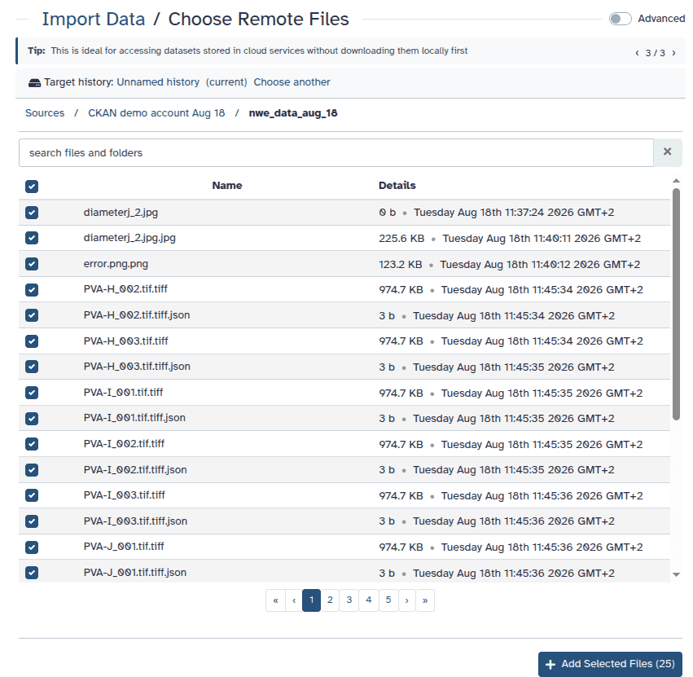

---
subsites:
- all-eu
title: "Connecting CKAN and Galaxy: from data repositories to analysis and back"
date: "2026-09-16"
tease: "Browse CKAN datasets in Galaxy, analyse using tools and workflows, and export results to CKAN."
hide_tease: false
tags: [interoperability]
contributions:
  authorship:
    - anuprulez
    - paulzierep
    - davelopez
  funding:
    - materialvitaldigital
---

Research data are often stored and managed separately from the environments
used to analyse them. A dataset may be published or maintained in CKAN,
they need to be downloaded, analysed in Galaxy, and uploaded again afterwards.
[CKAN](https://ckan.org/) is an open-source platform for managing and
sharing datasets through data portals and research data repositories.
A new [CKAN repository integration](https://github.com/galaxyproject/galaxy/pull/23116)
in Galaxy connects a CKAN instance to Galaxy. It lets users browse CKAN
datasets from Galaxy, and import datasets into a history. The imported
datasets can be analysed with Galaxy tools and workflows, and export results
back to CKAN.

In CKAN terminology, a **dataset** is a collection of metadata and **resources**.
Resources are the actual files or links associated with that dataset.
In Galaxy, CKAN datasets therefore appear as folders and their resources
appear as files.

[Public CKAN datasets](https://mvd.materials.digital/) can be browsed without
authentication. Connecting with a CKAN API token additionally makes private
datasets available according to user's CKAN permissions and allows results to be
exported when a user has write access.

## Connect your CKAN account

To access private datasets or export results, you need a CKAN account and an
API token.

CKAN API tokens can usually be created from **User Profile > API tokens**.
See the [CKAN API documentation](https://docs.ckan.org/en/2.11/api/#authentication-and-api-tokens)
for more information.

In Galaxy, open your user preferences and select **Manage Your Repositories**,
then click on **Create** and choose **CKAN**.

Give the connection a descriptive name and provide:

- Your **CKAN instance endpoint**, for example `https://ckan.example.org`.
- Your **CKAN Access Token** if you want to access private datasets.
- **Allow Galaxy to export data to CKAN** enabled if you want to send Galaxy
results back to CKAN.

The token is optional if you only need to browse and import publicly available
CKAN datasets.

Access follows the permissions of your CKAN account. Galaxy does not give the
connected account additional access to datasets or organizations.

## Bring CKAN resources into a Galaxy history

Open **Upload**, choose **Choose remote files**, and select your CKAN connection.

Galaxy shows the CKAN datasets that are available to you. With an API token,
this includes private datasets that your CKAN account can access.

Without a token, only public datasets are available. You can use the search field
to find datasets on larger CKAN instances.

Open a dataset to see its resources. Each CKAN resource is shown as a file
that can be selected and imported into a Galaxy history.

Once the resource appears in your history, you can process it using Galaxy
tools and workflows as usual.

## Send analysis results back to CKAN

Galaxy can export datasets as new resources inside an **existing CKAN dataset**.

1. Open Galaxy's **Export datasets to repositories** tool (`export_remote`) and
select the Galaxy dataset you want to export.

2. Choose your CKAN repository and select the destination CKAN dataset.

3. The export browser only offers datasets that your CKAN account is allowed to
modify. CKAN distinguishes between permission to read a dataset and permission to
update it.

4. Run the export and return to CKAN. The Galaxy output will appear as a new
resource in the selected CKAN dataset.

## Public, private, and writable datasets

The datasets visible while importing and exporting can be different.

When **importing**, Galaxy shows datasets that CKAN allows your account to read:

- Public datasets are available to everyone.
- Private datasets are available when your API token has the required access.

When **exporting**, Galaxy further restricts the list to datasets that your
account can modify.

This means that a public dataset can still be a valid export destination when
you have write permission in its organization, while a private dataset may be
read-only when your account does not have permission to update it.

## Export Galaxy histories

The CKAN integration can also be used with Galaxy's repository-based history
export functionality.

When asynchronous Galaxy tasks are enabled by the server administrator, a Galaxy
history can be exported as an archive into an existing CKAN dataset.

The archive becomes another CKAN resource and can later be imported back into
Galaxy through **Import History**.

This can be useful when the analysis itself needs to be preserved alongside other
project data stored in CKAN.

## A few things to know

- A CKAN **dataset** is not the same concept as an individual dataset in a Galaxy
history. A CKAN dataset acts as a container that can hold multiple resources.

- Galaxy imports **resources** from CKAN datasets. The resource itself may be
stored directly by CKAN or may refer to data hosted elsewhere.

- Export currently adds a new resource to an **existing CKAN dataset**.
Creating a new CKAN dataset directly from Galaxy is not supported.

- Create datasets, organizations, and their metadata in CKAN before exporting
files from Galaxy.

- The datasets shown during export depend on your CKAN write permissions, not
simply on whether a dataset is public or private.

- CKAN resources can point to files hosted outside the CKAN server itself.
Galaxy validates these resource URLs before downloading them and only sends
the CKAN API token to resources hosted by the CKAN instance.

By connecting CKAN directly to Galaxy, data can remain organized in the repository
used by a project while computational analysis takes place in Galaxy.
Input data can move from CKAN into reproducible Galaxy workflows and resulting
files can be returned to the same repository without the repeated manual
download-and-upload cycle.

## Acknowledgements

We thank Adrian Jäger for his work on the CKAN integration into Galaxy.
