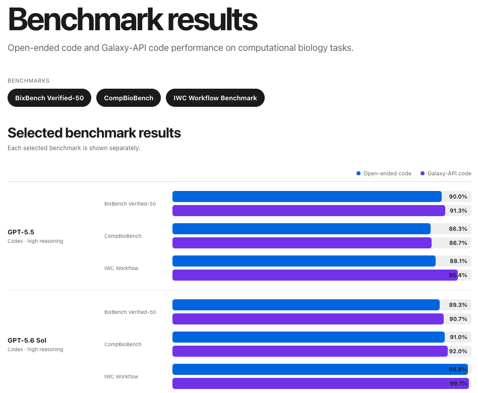

#### ***Across 160 bioinformatics tasks, agents using Galaxy achieved accuracy comparable to agents writing custom code.***

**Authors: Junhao Qiu, Paulo Lyra, and Jeremy Goecks**

Biomedical scientists are increasingly using AI agents such as [Claude Code](https://claude.com/product/claude-code) and [Codex](https://chatgpt.com/codex/) to perform bioinformatics data analyses, from differential gene expression to multi-omic profiling to single-cell analysis. [Galaxy](https://galaxyproject.org) brings thousands of software analysis tools and high-performance computing resources into one workbench, potentially offering agents a rich resource for doing bioinformatics analyses. However, until now it's been unclear how well agents can use Galaxy. **In this post, we share our findings from ~1,900 bioinformatics tasks that AI agents performed using Galaxy and show that agents can use Galaxy very effectively for bioinformatics.**

### Here's what we did:
- We asked state-of-the-art AI agents to complete 160 bioinformatics tasks either using Galaxy or by writing their own custom code. Accuracy was measured by whether the agents got the correct answer to each task. 
- We evaluated the performance of four different large language models—GPT-5.5, GPT-5.6 Sol, GPT-5.6 Luna, and DeepSeek V4 Pro—with a common agent harness. 
- Each agent was evaluated on 160 tasks from three benchmarks: (1) a custom Galaxy WorkflowBench created from [Galaxy's Workflow Repository](https://iwc.galaxyproject.org/) (10 tasks), (2) [BixBench-Verified-50](https://huggingface.co/datasets/phylobio/BixBench-Verified-50) (50 tasks), and (3) [CompBioBench](https://huggingface.co/datasets/Genentech/compbiobench-data-v1) (100 tasks). Agents completed each task three times to produce 3,840 agent task completions, half using Galaxy and half writing their own code.

\
Agents were able to use Galaxy very effectively. Average agent accuracy on these biomedical data analysis tasks was comparable between agents using Galaxy and agents writing their own custom code. The table below summarizes agent performance on these benchmarks using Galaxy and writing their own code.

| Benchmark | Average agent accuracy with Galaxy | Average agent accuracy writing their own custom code | Example task | 
| --------- | --------- | --------- | --------- |
| WorkflowBench | 98.2% | 94.6% | Assemble one complete mitochondrial sequence using a set of PacBio HiFi reads. |
| [BixBench-Verified-50](https://huggingface.co/datasets/phylobio/BixBench-Verified-50) | 87.7% | 87.2% | Compare the number of significant miRNAs after Bonferroni and Benjamini–Yekutieli correction. |
| [CompBioBench](https://huggingface.co/datasets/Genentech/compbiobench-data-v1) | 87.0% | 86.7% | Using a single-cell dataset, recover species proportions and assign a tissue of origin for each species. |

\
\
[Here's a website where you can browse the full results, filtering by agent or benchmark](https://goeckslab.github.io/agent-benchmark-results/).

### Five interesting observations from our analysis of how agents use Galaxy:
- Agents were able to use a range of core Galaxy features: create analysis histories, query Galaxy for available tools, set tool parameters, run tools, and derive analysis conclusions from tool outputs and reports.
- Agents frequently used different tools for the same analyses but obtained the same results, showing that Galaxy supports a wide range of approaches.
- Agents sometimes used [user-defined tools](https://galaxyproject.org/tools/user-defined-tools/) when Galaxy tools were not sufficient to complete tasks. [User-defined tools](https://galaxyproject.org/tools/user-defined-tools/) enable Galaxy users, and now agents, to write and run their own simple tools directly from the Galaxy interface through custom code. Agents used user-defined tools in ~30-40% of all tasks.
- When agents got the wrong answer, the errors were typically a mix of missing biomedical knowledge and technical mistakes. For instance, the goal in one task was to identify an outlier file amongst a set of 10 sequence files. Most agents struggled with this task. Agents failed to identify useful analyses to run, which is a shortcoming in their biomedical knowledge. And when they did run analyses, they didn't do so in a way that helped identify the outlier, which is technical mistake.
- Galaxy's rich user interface is very useful for helping scientists understand what an agent has done. This in turn helps scientists validate agent outputs and guide agent behavior. 

### Conclusions

These results suggest that Galaxy enables agent-driven bioinformatics analyses with accuracy levels comparable to custom-code approaches. Galaxy also provides scientists with ways to understand, verify, and steer agents. These benchmarks are a useful starting point, and we will soon evaluate agent-based Galaxy usage on more challenging bioinformatics tasks. Next steps for incorporating agents into the Galaxy ecosystem include publishing the Galaxy WorkflowBench, rerunning our benchmarks with newer agents, and deploying agent-optimized user interfaces for Galaxy.

