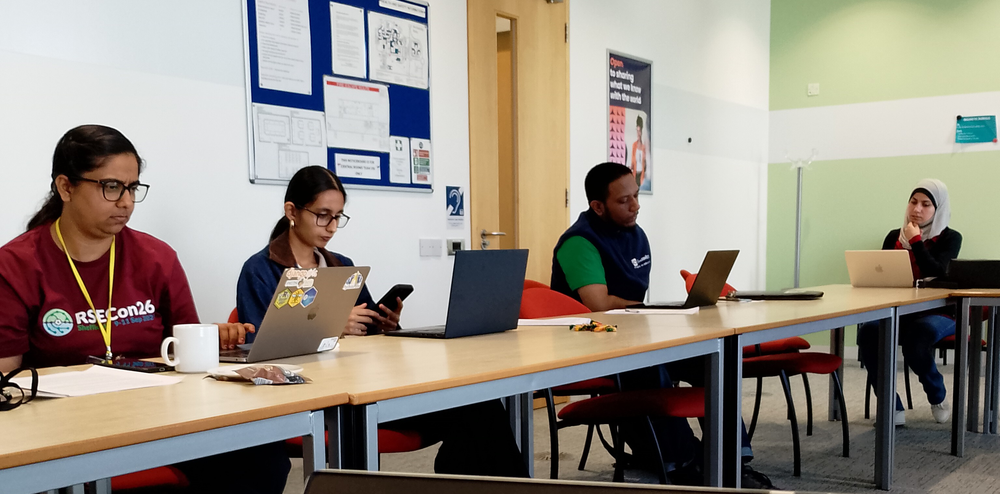
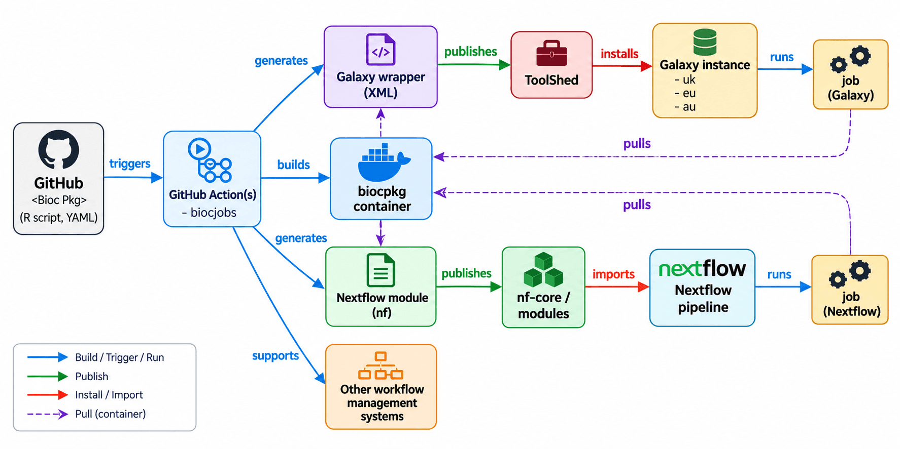

Members of the Galaxy, Bioconductor, and nf-core communities came together at The Open University campus in Milton Keynes last week for a three-day training event and CoFest focused on single-cell analysis.

The event brought together new Galaxy users, experienced bioinformaticians, and developers from all three communities - both online and in person. Since our time on campus coincided with the Heritage Open Days festival, those of us who made it to Milton Keynes were able to tag along on a tour of The Open University to learn about its history as a university created to be open for all. This is a goal that resonated with the aims of our event: to enable more life scientists to use Galaxy and to support developers making their tools openly available across workflow platforms.

## Single-Cell Training

The training side of the event was the final part of [a series of single-cell workshops](https://training.galaxyproject.org/training-material//events/2026-07-06-biofair.html) delivered by Marisa over the summer during her BioFAIR fellowship. The focus of her fellowship has been on ensuring that when workflows are created and shared according to the FAIR principles, users will actually engage with them and apply them to their own data. On the first day of the event, she led a group of students through their first Galaxy tutorials, while Pavan from the Galaxy EU team in Freiburg supported one ambitious learner as he began his first independent spatial omics analysis on Galaxy.

## FAIR Workflows across Platforms

Alongside the training, Kevin led a single-cell CoFest as part of his BioFAIR Pathfinder project, which is connecting single-cell developers across the Galaxy, Bioconductor, and nf-core communities. The aim of his project is to make single-cell tools, workflows, and training materials more accessible and interoperable across these three platforms initially, paving the way for expansion to other communities in the future. This can be achieved by [BioCJobs](https://blog.bioconductor.org/posts/2026-08-21-biocjobs/), an approach that allows Bioconductor package developers to define batch-oriented analysis tasks in a standard format, from which workflow-specific representations can be generated automatically. Following intense discussions between the online and in-person participants, the group produced a diagram capturing the ideal workflow from an initial commit to a Bioconductor package, through automatic generation of wrappers, to making tools available across Galaxy, nf-core, and other workflow environments.

CoFest participants also gained hands-on experience converting steps from an exemplar Bioconductor single-cell workflow into BiocJobs.

## Acknowledgements

The Data to Discovery event was made possible by funding from BioFAIR, an ELIXIR-UK flexible fund, and support from the Institute for Research Software. This support was particularly important for our student participants as we were able to provide small grants to enable them to travel to Milton Keynes.

## Get Involved

Any new or experienced single-cell Galaxy users are invited to join the [Single-Cell and Spatial Omics Community (SPOC)](https://galaxyproject.org/community/sig/singlecell/). The next meeting is on 1 October, with a special user-focused discussion about what users need and what they would like to see developed next - [find out more here](https://docs.google.com/document/d/19W--oeFoEgfZbw9MWvky_A__554th-VG3ryOqtfmHSA/edit?tab=t.ikggoqty5qt#heading=h.1jb2kerez6oh).

Anyone who is interested in the ongoing Pathfinder project can [join the Bioconductor Zulip and the #biofair2026-workflow-sprint channel](https://community-bioc.zulipchat.com/join/zsfbiqh64t3nq5ldrmv72b4w/) and follow the BiocJobs topic for ongoing discussion on making Bioconductor tools available through platforms like Galaxy.
