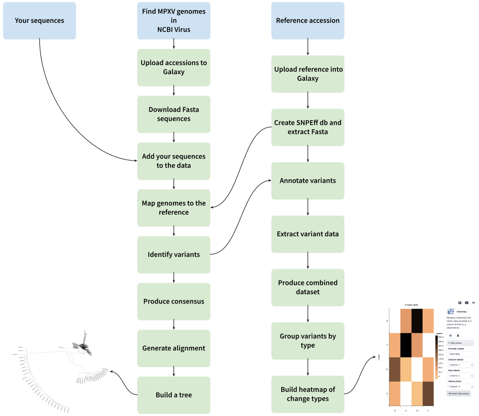

# 0. The goal

Suppose you just identified a new pathogen and would like to understand how it compares to already existing data. Where does it fit on the tree? Does it have any interesting biases in nucleotide changes? How to get quick rough answers to these questions? This tutorial does exactly that. To illustrate how you would do it we will use a sequence [recently identified](https://virological.org/t/travel-associated-monkeypox-virus-genomes-from-two-german-patients-and-of-a-derived-virus-isolate-all-closely-related-to-a-us-sequence-2022/844) by the virology group from Frieburg University ([Fuchs 2022](https://virological.org/t/travel-associated-monkeypox-virus-genomes-from-two-german-patients-and-of-a-derived-virus-isolate-all-closely-related-to-a-us-sequence-2022/844)). 

The flowgram below shows the steps. It may seem that there are many. However, the point of these tutorails is to pay attention to smallest details to make these analysis can be easily repeated and extended by anyone. Clicking on each block on the following flowchart will take you to a detailed description within this page. 



# 1 Preparing the data

## 1.1 Finding genomes of closely related organisms

If you work with viruses the place to start will be [NCBI Virus](https://www.ncbi.nlm.nih.gov/labs/virus/). For bacterial or other genomes [NCBI Datasets](https://www.ncbi.nlm.nih.gov/datasets/) will work best. We will cover NCBI Dataset functionality in future episodes. 

In our case we work with a viral sequence isolated from an individual infected with Monkeypox. We will begin at [NCBI Virus](https://www.ncbi.nlm.nih.gov/labs/virus/) by finding all genomes belonging to Monkeypox. 

Going to https://www.ncbi.nlm.nih.gov/labs/virus/ and repeat the procedure shown in the animated figure below:


| Fig. 1. Getting accession list from NCBI Virus |
|:-----:|
|<iframe width="1000" height="562" src="https://www.youtube.com/embed/apjvbnD4umM" title="YouTube video player" frameborder="0" allow="accelerometer; autoplay; clipboard-write; encrypted-media; gyroscope; picture-in-picture" allowfullscreen></iframe> |

You will download a file (names `sequences.acc`) that contains accession numbers of "complete" Monkeypox genomes present in the NCBI Virus database

## 1.2 Upload accessions to Galaxy

At this point we can switch to Galaxy. Go to an instance closer to you (US: https://usegalaxy.org, EU: https://usegalaxy.eu or Australia: https://usegalaxy.org.au), create an account and upload dataset:

| Fig. 2. Uploading accessions to Galaxy |
|:-----:|
|<iframe width="1000" height="562" src="https://www.youtube.com/embed/ZcmBr3hGVvs" title="YouTube video player" frameborder="0" allow="accelerometer; autoplay; clipboard-write; encrypted-media; gyroscope; picture-in-picture" allowfullscreen></iframe>|

Note that in this case the file is named `sequences-3.acc` because I tried to upload accession form NCBI three times.

## 1.3 Download actual data

Now that we have uploaded the file into Galaxy let's download actual sequences. For this we will use a special tool named `NCBI Accession Download`. **NOTE** that we change one of the parameters of this tool by checking the `Add accession to failed list and continue` option. This will insure that if there are any issues with downloading some of the sequences (as sometimes happens in downloads from NCBI) the process will not stop and will keep going. 

| Fig. 3. Downloading actual Fasta datasets |
|:--------:|
|<iframe width="1000" height="562" src="https://www.youtube.com/embed/aMhP8ZPjlXQ" title="YouTube video player" frameborder="0" allow="accelerometer; autoplay; clipboard-write; encrypted-media; gyroscope; picture-in-picture" allowfullscreen></iframe>|

At the end of this operation you will have a collection of Fasta sequences. A collection is like a folder containing multiple individual files. This is done on purpose as it is important to keep individual genomes separately and not as one big multi-Fasta file. 

## 1.4 Picking a reference

To continue our analyses we need to pick a reference genome against which we will be performing comparisons. This is often a subjective choice. In the case of Monkeypox (as of June 2022) the "official" reference is [NC_003310](https://www.ncbi.nlm.nih.gov/nuccore/NC_003310) from Zaire. However, searching around sources such as, for example, virological.org points to [MT903340](https://www.ncbi.nlm.nih.gov/nuccore/MT903340) as a more appropriate choice. So, let's settle on [MT903340](https://www.ncbi.nlm.nih.gov/nuccore/MT903340) as a more appropriate choice. We now need to download GenBank representation of this genome to Galaxy. We will use the same `NCBI Accession Download` but some modifications as shown in Fig. 4A. The problem with using `NCBI Accession Download` is that it generates collection as an output. And since we are downloading only a single accession this will be a collection with just one dataset. So once the download is finished we will use `Extract dataset` tool to convert it into a single file in the Galaxy's history (Fig. 4B).

| Fig.4A Uploading reference | Fig. 4B Extracting single dataset |
|------|------|
| |  |

We specifically uploaded reference as the GenBank file because it contains the annotation data.

## 1.5 Building SNPEff database and extracting Fasta 

Now we can use GenBank dataset with the reference genome to build SNPeff database and extract Fasta sequence. The database will be used for annotating variants and Fasta sequence for mapping and variant identification.  We will use `SnpEff build` as shown below. Here we give our database a name (`MPXV`) and selecting Genbank dataset to use:

| Fig. 5. Building SNPEff database ad extracting Fasta |
|--------|
||

## 1.6 Add your sequence(s) to the mix

Not that we have downloaded existing Monkeypox sequences and decided on the reference we need to inject our own data into the mix since this the point of doing this analysis. As we mentioned in the beginning we will use sequenced generated by Freiburg University and described in this [post](https://virological.org/t/travel-associated-monkeypox-virus-genomes-from-two-german-patients-and-of-a-derived-virus-isolate-all-closely-related-to-a-us-sequence-2022/844). To do this we will upload sequences provided by the authors as shown in the figure below. There are several things to unpack in this video. The first is that within the upload popup we select **Collection** tab. This allows us to upload these 


| Fig. 6. Adding and merging your own data |
|:--------:|
|<iframe width="1000" height="562" src="https://www.youtube.com/embed/tISxdtHjpx4" title="YouTube video player" frameborder="0" allow="accelerometer; autoplay; clipboard-write; encrypted-media; gyroscope; picture-in-picture" allowfullscreen></iframe>|


# 2 Understanding relationship between samples

##  2.1 Generating whole genome alignments against reference

To align downloaded genomes against the reference we will use `minimap2` as shown below (there are other appropriate tools in Galaxy as well such as `lastz` for example). **Note** the parameter selection here:

- We use `Use a genome from history and build index` option and select Fasta sequence for the reference generated during step [1.5](#15-building-snpeff-database-and-extracting-fasta)
- In `select fastq dataset` we click collection button (rightmost) and selected the merged collection (produced at step [1.6](#16-add-your-sequences-to-the-mix)) as "reads"
- Finally we set `Select a profile of preset options` to <kbd>Long assembly to reference mapping... (asm5)<kbd> option

| Fig. 7 Mapping genomes to reference with `minimap2` |
|------------|
||

This would generate a collection of BAM files representing the alignments

## 2.2 Identifying differences between genomes

To identify differences between genomes we can simply run a variant caller such as `lofreq` by setting parameters in the most relaxed way. This is because our BAM files represent an alignment of one "read" (an entire genome) against the reference (another genome), so filtering by strand bias or base qualities becomes irrelevant. So let's use `lofreq` with setting set as shown below. `lofreq` takes a lot of parameters and thus we show then as four panels below. **Note** that we effectively turn off all filtering and reduce `lofreq` to a simple variant counter:

| Fig.8A  | Fig. 8B |
|------|------|
| | |
| **Fig. 8C**  | **Fig. 8D** |
| | |

This produces a collection of VCF files: one for each `minimap2` BAM file. 

## 2.3 Generating consensus sequencing

Now we can turn VCF files generated at the previous step into consensus sequences. We can use these later (see step 2.5) to build phylogenetic trees. To do this we will use `bcftools consensus` . **Note** the settings and particularly the one highlighted in orange:

| Fig. 9 Creating consensus from variants |
|------------|
||

The result of this analysis will be a collecting of Fasta files. In each file the differences between an aligned genome and the reference will be replaces with `ALT` calls from VCF files. 

## 2.4 Generating a psedo-alignment

During the previous step we have created consensus sequences for all Monkeypox genomes in our analyses using the reference as the coordinate system. This implies that if we combine all sequences in a single file we will generated an equivalent of a multiple sequence alignment. So all we need to do is to collapse a collection of consensus sequences generated at the previous step into a single dataset. This is done using `Collapse Collection` tool:

| Fig. 10 Generating pseudo alignment |
|------------|
||

## 2.5 Building a tree

Let's quickly get an idea of phylogenetic relationship between sequences in this analysis. We can use alignment generated above to build a tree using a fast classical Neighbor Joining approach implemented in `RapidNJ`:

| Fig. 11 Building a tree with RapidNJ |
|------------|
||

This generates a tree file in [Newick format](https://evolution.genetics.washington.edu/phylip/newicktree.html). To look at the three we can use `Newick Display` tool shown below (or an external viewer such as [FigTree](http://tree.bio.ed.ac.uk/software/figtree/)). We use the following parameters to make a circular tree with legible labels:

 Fig. 12 Viewing a tree |
|------------|
||

The resulting tree is shown below. The [KJ642615](https://www.ncbi.nlm.nih.gov/nuccore/661921128/) branch represents all isolate form Western Nigeria. There are three prominent clades. Freiburg samples have cluster together with sequences from West Africa such as [MK783028](https://www.ncbi.nlm.nih.gov/nuccore/MK783028) from Nigeria.

| Fig. 13 The tree |
|------------|
||

# 3 Processing variants

## 3.1 Annotating variants with SNPEff

During step [1.5](#15-building-snpeff-database-and-extracting-fasta) we have created a SNPEff database. We can use this database to annotate variants called during step [2.2](#22-identifying-differences-between-genomes). For this we will use `SNPeff eff` as shown below. This would allow us know, for example, which differences between genomes are synonymous or non-synonymous. `SNPEff` has a large number of parameters. The the two panels below show exact settings we have used. **Note**: `SNPEff eff` takes two inputs. The first is the SNPeff database we created at step [1.5](#15-building-snpeff-database-and-extracting-fasta) (orange box) and the second is variants we called with `lofreq` on step [2.2](#22-identifying-differences-between-genomes) (green box):

| Fig. 14A | Fig. 14B |
|----------|---------|
| | |

this step will produce another VCF collection with annotated variants. 

## 3.2 Extracting variant data

To facilitate the downstream analysis of variant data we will convert VCF datasets into TAB-delimited format using `SnpSift Extract Fields`. Specifically:

- we use the following `Fields to extract` string <kbd>CHROM POS FILTER REF ALT DP AF DP4 SB EFF[\*].IMPACT EFF[\*].FUNCLASS EFF[\*].EFFECT EFF[\*].GENE EFF[\*].CODON EFF[\*].AA EFF[\*].TRID DP4[2] DP4[3]</kbd>
- set `One effect per line` to <kbd>Yes</kbd>
- set `empty field text` to <kbd>.</kbd>

| Fig. 15 Extracting fields with `SNPSift`|
|----------|---------|
| | 

this will produce a collection containing TAB-delimited datasets.

## 3.3 Produce single variant dataset

Up to this point we still have a collection - multiple files representing variant data for each sequence. It is time to combine them into a single dataset using `Collapse collection` tool. **Note** the settings for prepending file name (orange square in Fig. 16A). This would add a separate column with sample names so would know which variant is found in which sample. We them immediate run 

| Fig. 16A Collapsing variant data | Fig. 16B Removing header |
|----------|---------|
| |  |


This would produce a single dataset containing all [variant data](https://usegalaxy.org/datasets/bbd44e69cb8906b5c138a3a690c881e8/display/?preview=True){:}. This is the list of all fixed variants that exist between genomes analyzed here. 

## 3.4 Group variants by site and by type

Finally we will perform two groupings shown below. This would allow us to give a rough idea about the types of changes present among these sequences. First we will group by position, reference base, and alternative base of the combined variant dataset (Columns 3, 5, and 6). This will be done with `Datamash` as shown in Fig. 17A. We will immediately use the result of this operation to perform additional grouping by REF, and ALT (positions 2 and 3 of the dataset generated at the previous step):

| Fig. 17A Grouping by Position, REF, ALT| Fig. 17B Counting substitution types |
|----------|---------|
| |  |

The [resulting dataset](https://usegalaxy.org/datasets/bbd44e69cb8906b5221f1bf2fdfd15c1/display/?preview=True) looks like this:

```
A	C	61
A	G	252
A	T	56
C	A	102
C	G	9
C	T	436
G	A	402
G	C	13
G	T	98
T	A	56
T	C	271
T	G	70
```

## 3.5 Build a heat-map of changes

To visualize the above matrix we can use built-in Galaxy visualization by clicking the visualization icon adjacent to the dataset (orange arrow in Fig. 18A) and configuring the visualization as shown in Fig. 18B.

| Fig. 18A Triggering heatmap visualization| Fig. 18B Configuring heatmap visualization |
|----------|---------|
| |  |

Similarly to previous [observations](https://virological.org/t/initial-observations-about-putative-apobec3-deaminase-editing-driving-short-term-evolution-of-mpxv-since-2017/830) C->T and G->A are predominant fixed changes.

And this is it. Hopefully this would give you a taste of what can easily be done using existing Galaxy tools.


