# Galaxy Data Libraries and Sample Tracking Tutorial

## About Galaxy

[Galaxy](http://galaxyproject.org) is a framework for integrating computational tools. It allows nearly any tool that can be run from the command line to be wrapped in a structured, well defined interface.

On top of these tools, Galaxy provides an accessible environment for interactive analysis that transparently tracks the details of analyses, a workflow system for convenient reuse, data management, sharing, publishing, and more.
This tutorial provides information about using Galaxy's [Data libraries](../../../Admin/DataLibraries/Libraries) and [Sample Tracking system](http://main.g2.bx.psu.edu/u/rkchak/p/sts).  The tutorial assumes you have a functional Galaxy instance running.

## Data Libraries

An "Admin" link will appear in the Galaxy top menu bar when you login to Galaxy as an [admin user](../../../Admin/Interface), and clicking the link will display the Admin perspective which includes a menu of features in the left panel.

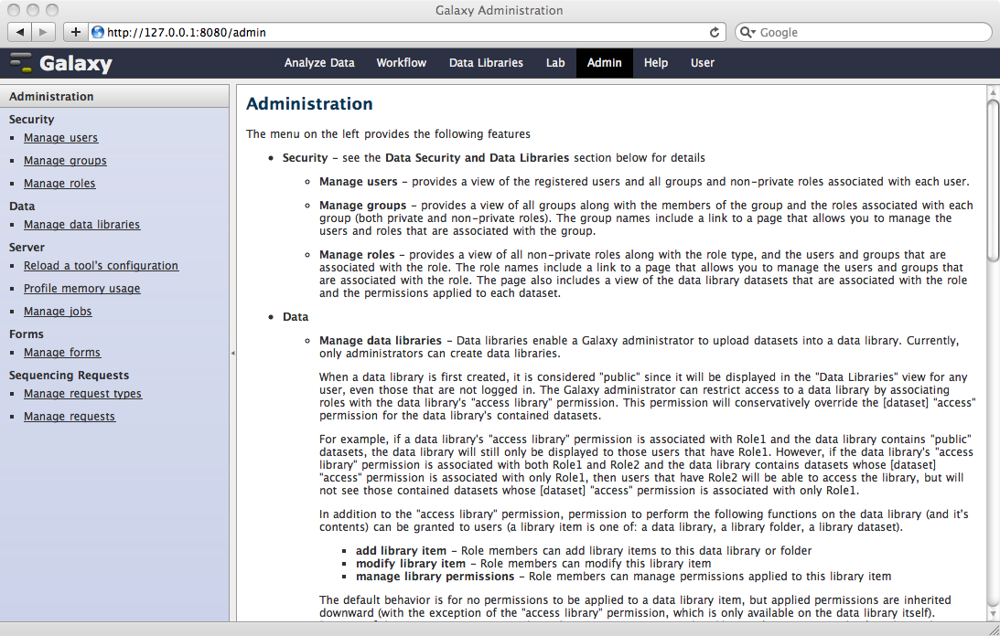

We'll be dealing with a number of different users in this tutorial, which can be viewed when you click the "Manage users" link in the menu.

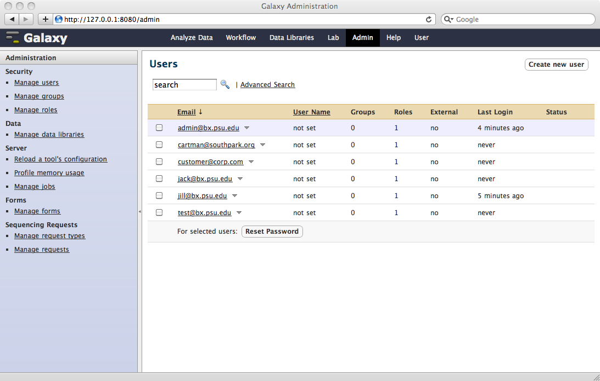

Data libraries provide a hierarchical container for datasets (i.e., library datasets). Data libraries can contain datasets and folders, and folders can contain datasets and sub-folders, and so on.

Clicking on the "Manage data libraries" link in the menu displays the data libraries browser, and the "Create new data library" button in the upper right corner allows you to create a new data library.

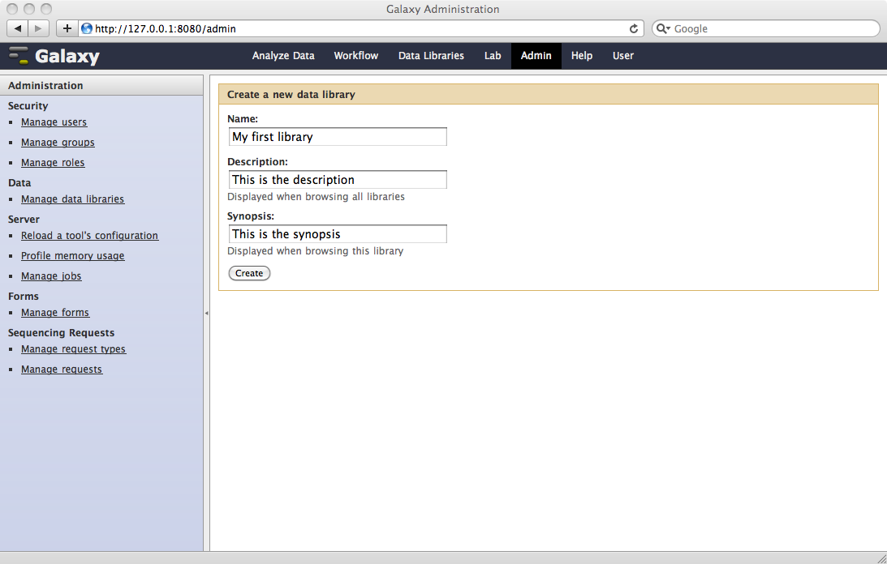

## Securing Data in Data Libraries

Galaxy's security for data libraries is powerful and flexible.  With regard to data libraries, "security" refers to restricting access to contained datasets as well as restricting actions that can be performed on a data library or it's contents.  Galaxy's data library security enables restricting access to any item (folders and datasets) in a data library hierarchy to any number of users, making it easy to secure data.

To demonstrate how data libraries provide data security, we'll add 2 folders to our library, one for Jack, and another for Jill.

We'll add a dataset to Jack's folder, restricting access to the dataset to Jack's private role.

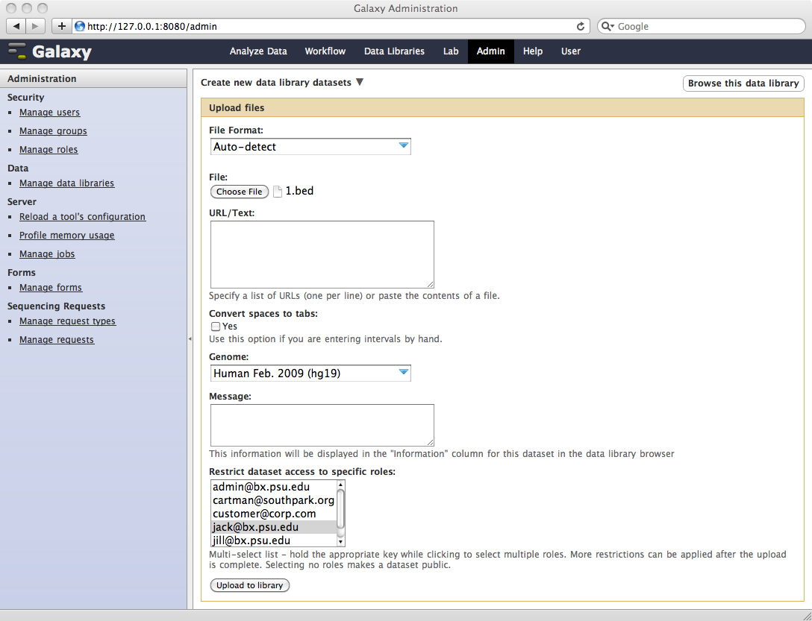

And we'll add a dataset to Jill's folder, restricting access to the dataset to Jill's private role.

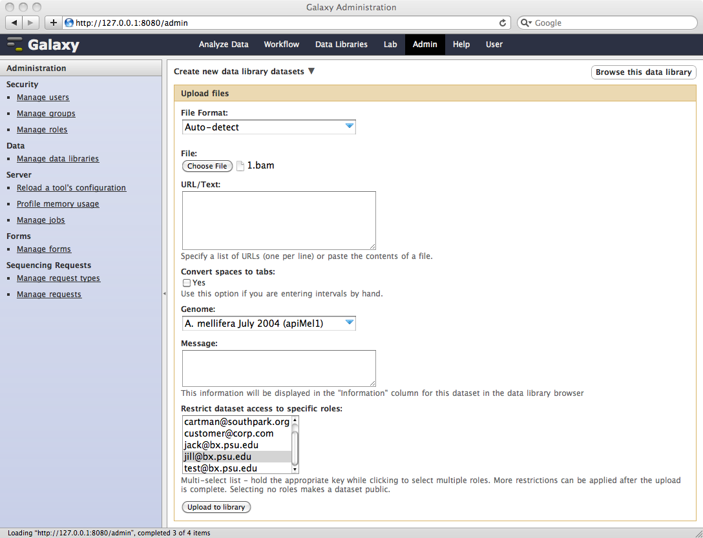

If we login as Jack, clicking on the "Data Libraries" link in the top menu bar will display the Data Libraries browser.  Notice that the "Admin" link is missing from the top menu bar.  This is because Jack is not an admin user.

Browsing "My first library" displays only Jack's folder and not Jill's because Jack does not have permission to access any of the datasets in Jill's folder.  Similarly, Jill will not see Jack's folder if she browses this data library.  If Jill's folder contained datasets that Jack could access he would see Jill's folder, but when browsing the folder he would see only the datasets he could access. 

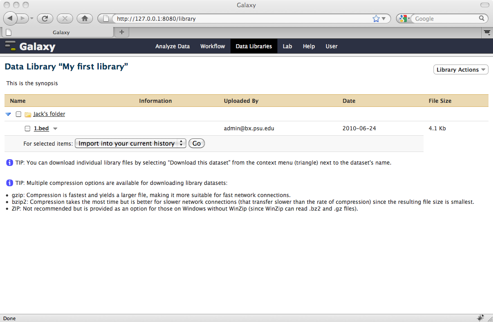

## Sample Tracking: Customer Submits a Request

Galaxy's sample tracking streamlines the delivery of data from sequencing runs to the customer.  The system can be used by a sequencing facility to handle their customer's sequencing requests.  The entire Galaxy sample tracking process, including sample request form layout and states, is defined by the facility, making it very simple to integrate the use of Galaxy into a facility's existing processes.  If a facility uses a LIMS, Galaxy sample tracking complements it - it is not intended to replace it.

A customer can submit a sequencing request to the facility, along with the samples for sequencing, and track the various states of the request as the samples are being sequenced in the facility.

To demonstrate some of the features provided by Galaxy's sample tracking system, we'll log in as Jill, who has a DNA sample that she'd like sequenced in her favorite facility.  Selecting the "Sequencing Requests" option from the "Lab" menu in the top menu bar will display all of the requests you've previously submitted (in our case, there are none yet).

Jill can create a request to sequence her sample by clicking the "Create new request" button.

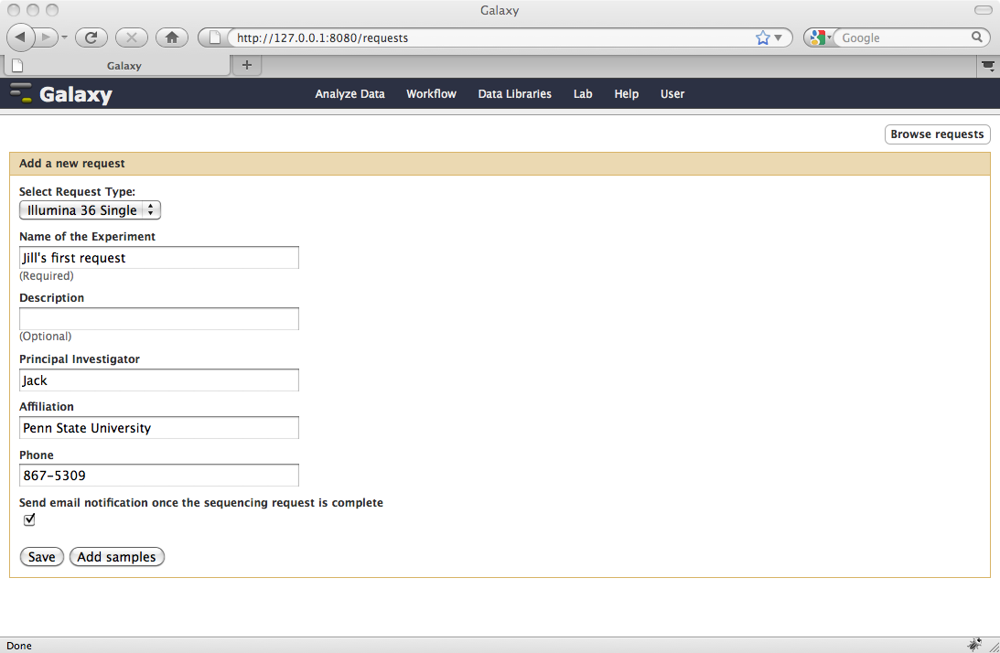

The "Select Request Type" list includes various sample request form layouts from which to choose, and they are defined by the facility manager.  Clicking the "Add Samples" button at the bottom of the page allows Jill to fill out the information for each of her samples.

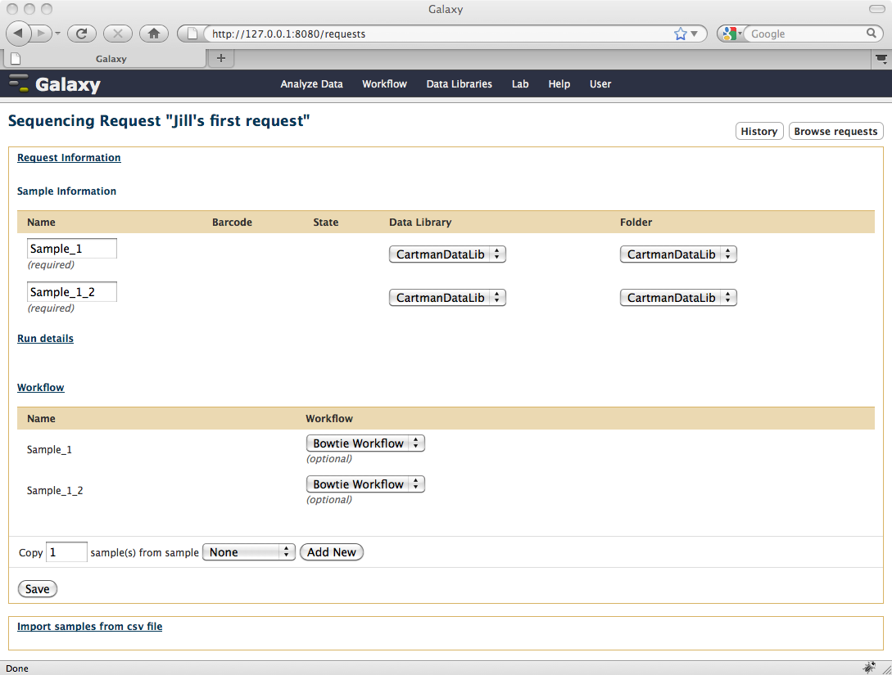

Notice that Jill has requested that the datasets produced from her sequencing runs be placed in the !CartmanDataLib data library and folder.  Jill is able to select any data library and folder for which she has been granted permission to add datasets.

A workflow can also be chosen to execute using the dataset as its initial input as soon as it arrives in the data library folder.  Jill can edit and save the information in her request any number of times until she clicks the "Submit Request" button in the upper right corner of the form.  After submitting the request, Jill will no longer be able to change it.

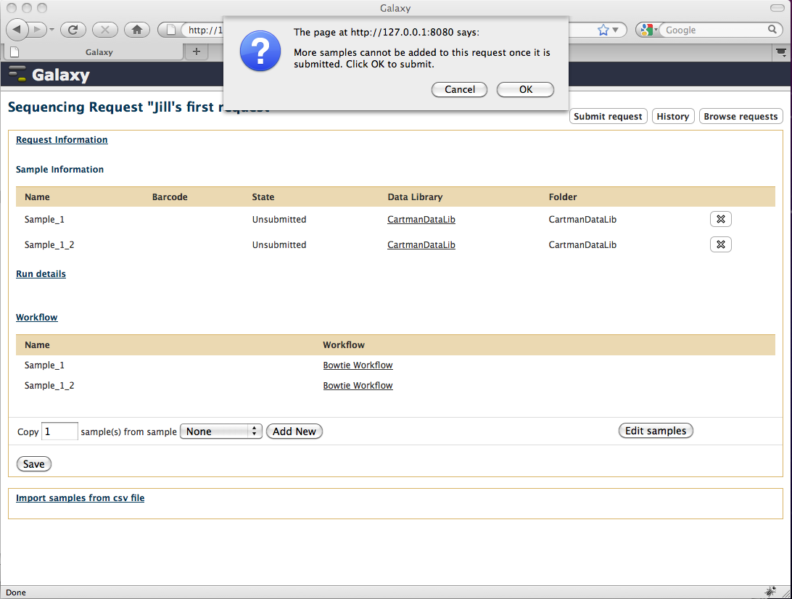

After Jill submits the request, it's state is "In Progress".

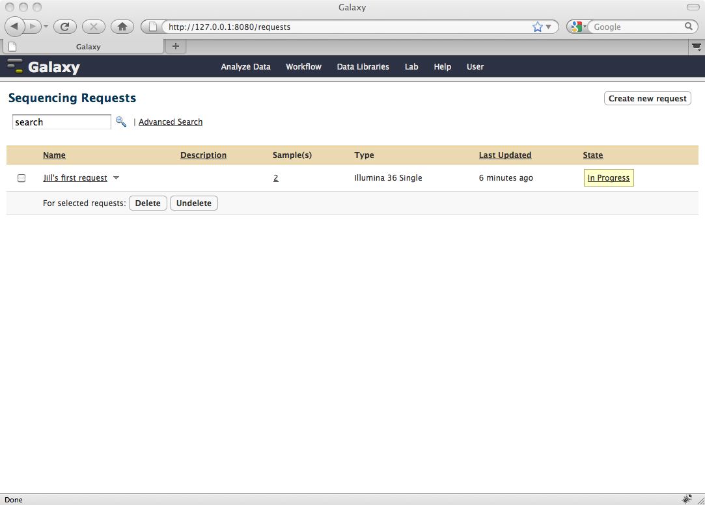

## Sample Tracking: Lab Technician Handles Jill's Request

Let's assume our facility uses the following process for handling sequencing requests.  When the sequencing request is received, and the tubes arrive at the facility, a bar code is applied to each tube.  The facility consists of 2 stations, each with a bar code scanner.  At the first station each tube is scanned when the samples are received, and at the second station each tube is scanned when the run is completed.

After Jill submits her request and the facility receives the samples, the facility technician will handle processing Jill's request from the Galaxy Admin perspective.  Clicking the "Manage requests" link on the Galaxy Admin menu will display all current open requests.

The facility technician applies bar codes to the sample tubes and scans them at the receiving station.

If Jill checks Galaxy for the status of her request, she'll see that the state has change to "Sample Received" since the tubes have been scanned at the facility's receiving station.

After the facility's sequencer has completed its run for each sample, the technician scans the tube at it's second station and the state of the request changes to "Run Complete", and finally "Dataset Available" when the dataset has been transferred to the requested !CartmanDataLib data library.

Since Jill checked the box labeled "Send email notification once the sequencing request is complete", she'll get an email letting her know her data is available.  Checking her request again, she'll see that state has changed to "Dataset Available" for each of her samples.

If Jill browses to the data library she requested for containing the datasets, she'll find that they are available there.

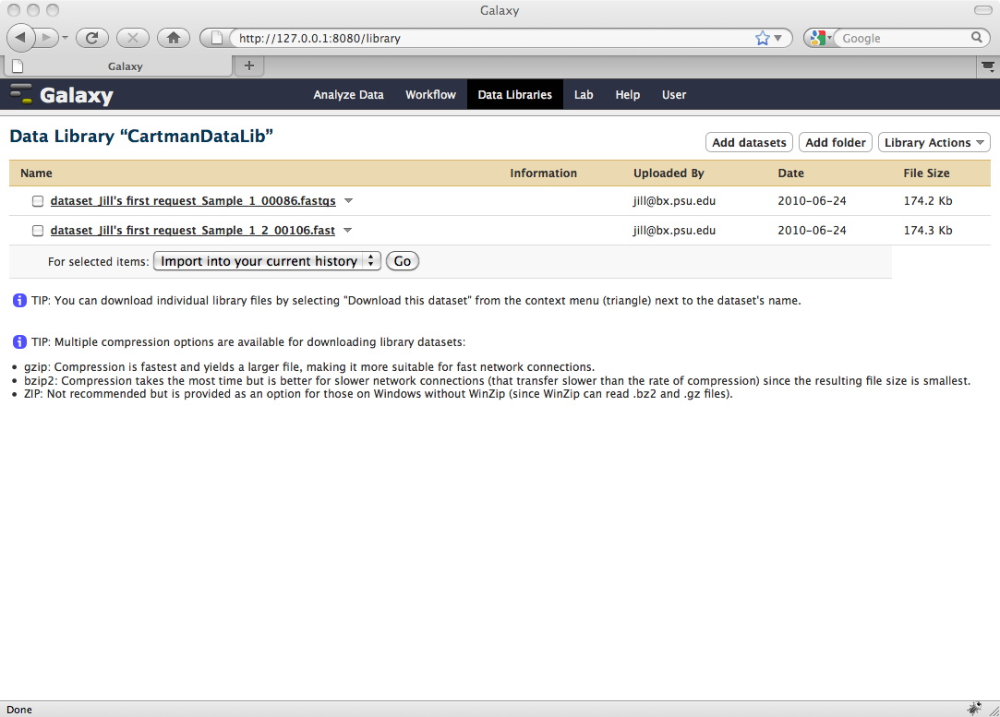

And if Jill views her current history, she'll see that the analysis that resulted from using her 2 datasets as input to her requested "Bowtie Workflow" is available for review.

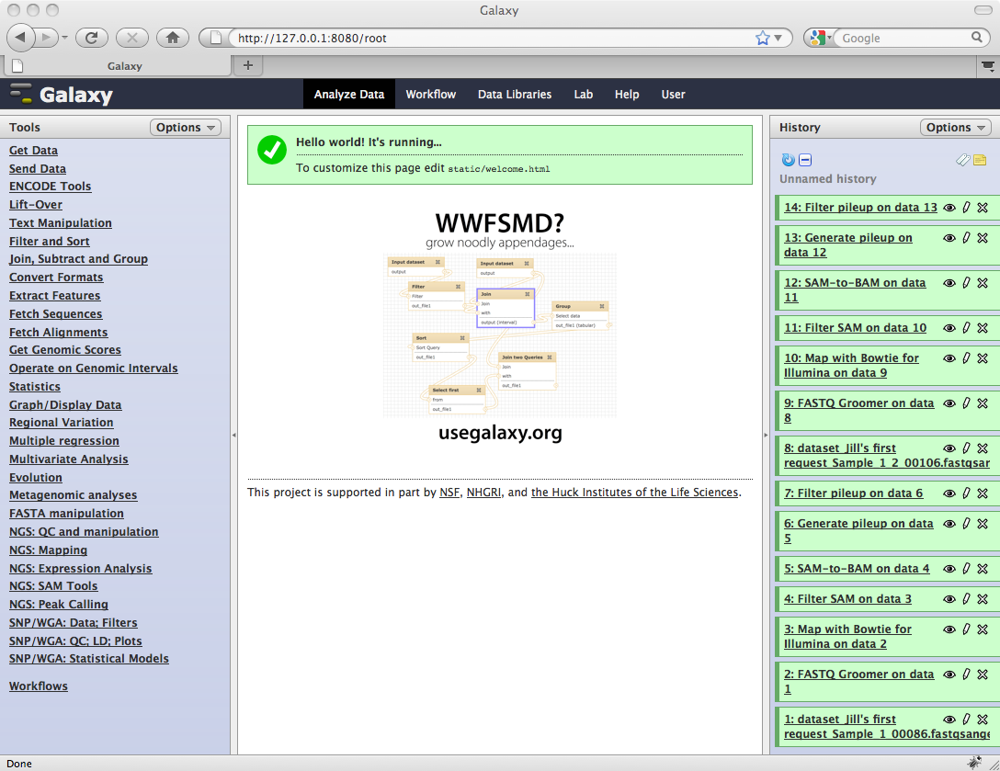

# Where to go next

We've only scratched the surface of what can be done with Galaxy. Here are some pointers for learning more:

* [More information about Galaxy data libraries](../../../Admin/DataLibraries/Libraries)
* [You can build complicated tool configurations](/src/Admin/Tools/ToolConfigSyntax/index.md)
* [Your Galaxy instance can run jobs on a cluster](/src/Admin/Config/Performance/Cluster/index.md)
* [Your Galaxy can be more robust and scalable](/src/Admin/Config/Performance/ProductionServer/index.md)
* [You can make local genomes, alignments, and other data available to Galaxy](../../../Admin/Data Integration)
* [You can customize what external applications are available for displaying datasets](../../../Admin/Tools/External Display Applications Tutorial)
* [You can customize the datatypes for a Galaxy instance](../../../Admin/Datatypes/Adding Datatypes)
* [You can instantiate Galaxy on the Amazon cloud](/src/CloudMan/index.md)

