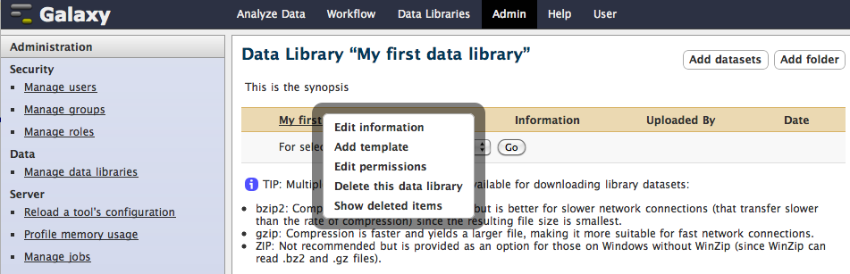
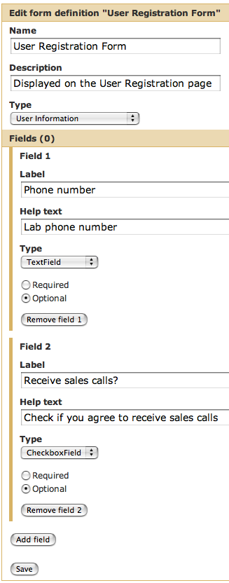
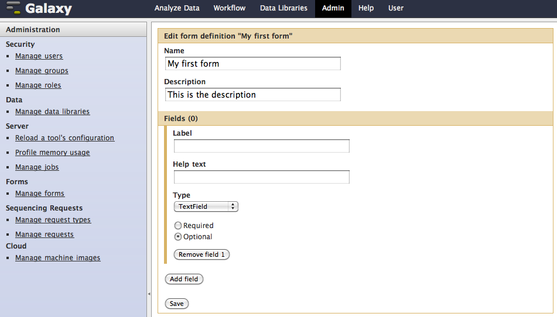
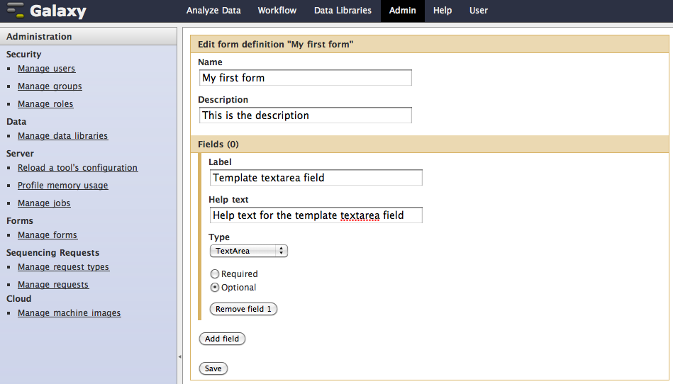
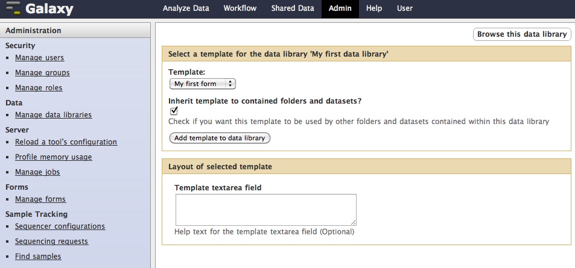
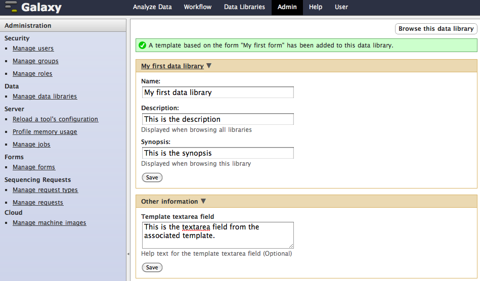
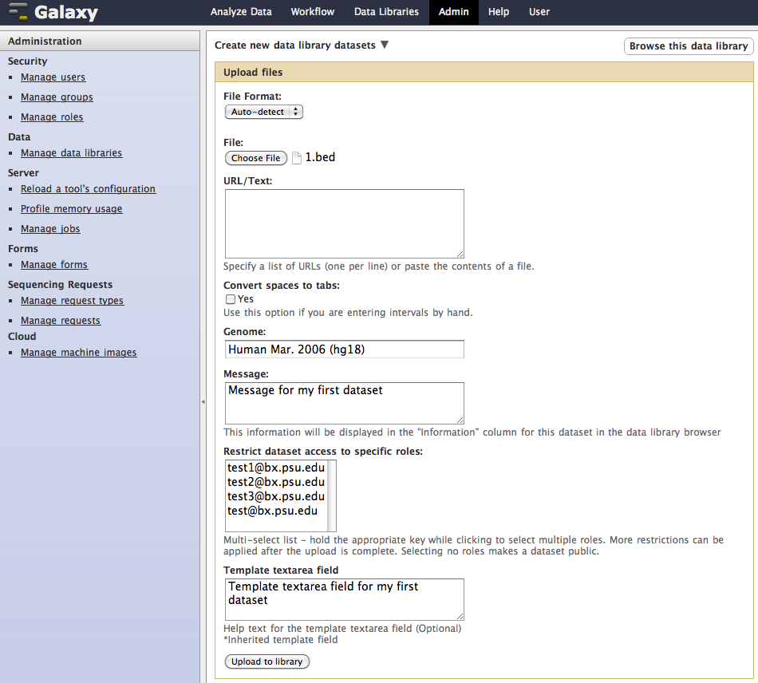
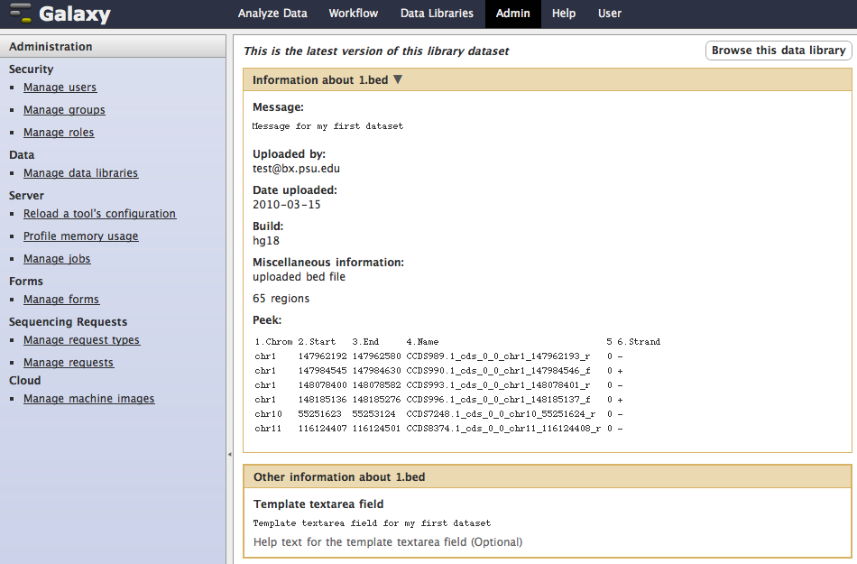
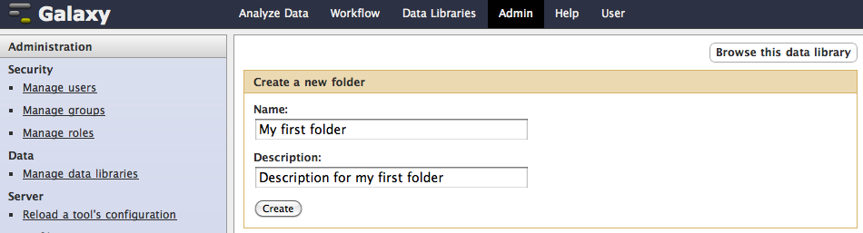
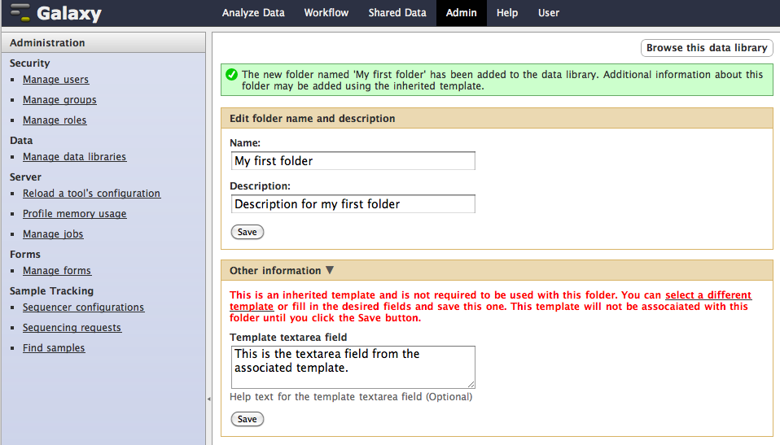

# Data Library Templates

----

Data library templates provide a way to associate information (metadata) with the data library or it's contained folders and datasets.  A template
is based on a Galaxy form, which must be defined before the template can be associated with a data library or any of it's contents.  There
are several types of Galaxy forms, and forms on which data library templates are based must be of type "Library information template".

This document assumes that you are in the Admin perspective which is available only to [admin users](../../../Admin/Interface) 
and is accessed by clicking on the "Admin" link in the top Galaxy menu bar.  However, users that are not admin users can also be granted 
permission to add and edit data library templates, although they will be doing so from the Data Libraries perspective which is accessible
by clicking on the "Data Libraries" option in the "Shared Data" pop-up menu in the top Galaxy menu bar.  For information about setting data 
library permissions for non-admin users, see our [Data Libraries Security page](../../../Admin/DataLibraries/LibrarySecurity).

### Adding a template to a data library

To add a template to a data library, select the "Add template" option from the data library pop-up menu.

If no forms of type "Library information template" exist, the following page will be displayed (if a form of of that type does exist, you'll
be able to select it rather than having to create a new one).

The form "Name" and "Description" fields must be filled in and the "Type" selected (make sure to select "Library information template") as
the first action on this page.  You can then import the form definition (the field layout) from a stored csv file, or manually add fields by
clicking the "Add field" button and setting the field type for each additional desired field.  The current list of supported field types is:

* !AddressField - displays a set of text fields that allows a user to enter a mailing address 
* !CheckboxField - displays a check box
* !SelectField - displays a select list whose options are specified by you when this type is chosen
* !TextArea - displays a text area
* !TextField - displays a text field
* !WorkflowField - displays a select list whose options are the current user's workflows

Form field attributes are "Label", "Help text", "Type", and whether filling in the field is required or optional.  For this example, we'll 
create a template that consists of just one optional field of type !TextArea.

When you have finished adding fields, click the "Save" button at the bottom of the page.  Then, to add the template based on this new form to
the data library, click on the "Manage data libraries" link in the Administration menu in the left menu panel, select the data library from the
data libraries browser, and select the "Add template" option once again from the data library pop-up menu (see details above).  You'll now
be presented with a list containing all existing forms of type "Library information template" from which you can choose the template.  When 
you select a specific form from the list, the field layout for that form is displayed to help you choose the one you want.

If checked, the checkbox labeled "Inherit template to contained folders and datasets?", will display the fields in this template on the
information pages for folders and datasets contained within the data library (more details on this will be presented shortly).  When you've
selected the template you want, click the "Add template to data library" button, and the page containing the information about the data
library (including the newly added template fields in the "Other information" section) will be displayed.  You can fill in the template 
fields on this page.  The pop-up menu to the right of the "Other information" section title allows you to edit the template layout, delete
the template from the data library, or inherit / dis-inherit the template to contained folders and datasets.  We'll leave the template as
inherited for now to demonstrate how inheritance works.

### Inheriting a template to a dataset

Let's add a new dataset to our data library.  From the data library information page displayed above, click the "Browse this data library"
button in the upper right corner of the page and then click the "Add datasets" button in the upper right corner of the resulting page.  
This will display the "Create new library datasets" page, which includes the inherited template fields.  Notice that the contents of the
template fields are also inherited (these can be over-written).  See our [uploading files to a data library page](/src/Admin/DataLibraries/UploadingLibraryFiles/index.md) 
for more details about uploading files to a data library.

After uploading the dataset to the data library, clicking on the dataset name (when browsing the selected data library) will display a page 
containing the information about the dataset.  The inherited template fields are included in the "Other information" section of
the page.

### Inheriting a template to a folder

Let's add a new folder to our data library.  From the data libraries browser, browse to the desired data library, and click the "Add folder" 
button in the upper right corner of the page.  The "Create a new folder" page will be displayed, allowing you to provide a name and optional
description for the folder.  When you have filled in these fields, click the "Create" button at the bottom of the page to create the folder.

After the folder is created, the following page is displayed allowing you to edit the name and description of the folder and fill in the
inherited template fields.  Notice that although the inherited template fields and contents are displayed, they are not associated with the
folder until you click the "Save" button.  This behavior allows you to more easily select another template to associate with the folder if
you want to override the inherited template.  Click the "Save" button at the bottom of each section on the page if you make any changes.

After the folder is created, clicking on the folder name (when browsing the selected data library) will display the same page above, and 
(if filled in) the inherited template fields are included in the "Other information" section of the page.

### More about template inheritance

Templates can be inherited and dis-inherited whenever you want.  For example, if you inherit a template from a data library to a folder and
keep the template "inherited" at the folder level, all new sub-folders and datasets within the folder will inherit the template.  Over time,
you can choose to "Dis-inherit" the template, after which the template will no longer be inherited by folders and datasets added **after** it
was dis-inherited.  The same behavior occurs at any level in the data library hierarchy.  The lowest level of template inheritance is a dataset 
(i.e., the "Other information" section for a dataset's information page will not include a pop-up menu containing the 
"Inherit template / Dis-inherit template" items).

### Editing a template

Over time, you may wish to change the layout of a template that is associated with a data library, folder or dataset.  To do this, select the
"Edit template" option from the pop-up menu for the item and the "Edit form definition" page will be displayed.

Here you can alter any of the attributes of existing form fields and you can add new fields to the layout or delete existing fields from 
the layout.  Folders and datasets that previously inherited the original layout will not be affected (their template layout and contents will
remain as they are), but those added to the data library after the template is edited will inherit the new layout.

### Deleting a template

At any time you can delete a template from a data library, folder or dataset.  Folders and datasets that inherited the template before it
was deleted will still have the template.  Deleting a template eliminates the fields and field contents from the associated information page
