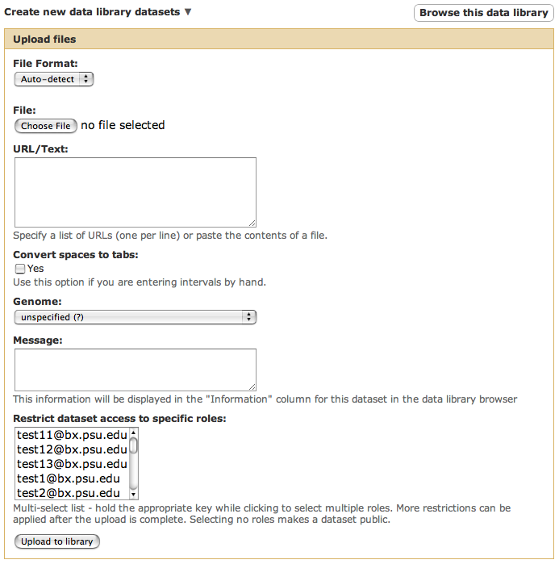
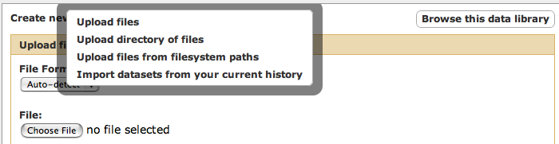
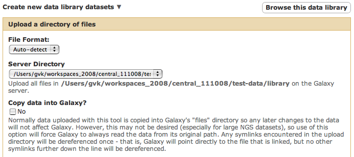
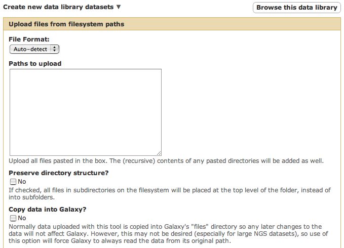

# Uploading Files to a Data Library
----

### Options for Uploading Files from the Admin Perspective

There are currently four options available to a Galaxy [admin](../../../Admin/Interface) user for uploading files to a data library.  
Some of these same options are available to all regular users that have been granted permission to add items to a Data Library or folder, 
but this section describes the features from the Galaxy admin perspective which is accessed by clicking on the "Admin" link in the top 
Galaxy menu bar.

By default, only the first option (Upload files) is available. To allow uploading directory of files or upload from from filesystem paths, change the options `library_import_dir` and `allow_library_path_paste`, respectively in the Data Libraries section of your config (`config/galaxy.ini` or `config/galaxy.ini`) See below for more details on the values for these options.

From the Data Library, clicking the Add datasets button will display this page (this same process for uploading files to a folder is
accessed from the folder's pop-up menu).



The different options for uploading files are available in the pop-up menu when you click the "down arrow" next to the 
"Create new data library datasets" page title.



Here are the details for each option.

### Upload files

This is the default, and displays the form above.  It enables you to upload locally accessible files, or URLs for retrieving data 
from remote sources.  This option creates a copy of the data files on the Galaxy server (the default directory is `database/files/`), 
and although it works for files of any size, the options described below are better suited for very large files.

### Upload directory of files

Here is a partial view of the form that is displayed when this option is selected.



The desired directory for this option must be specified in the Galaxy configuration file `config/galaxy.ini`.

```
# Directories of files contained in the following directory can be uploaded to a library from the Admin view
library_import_dir = /some_local_directory_of_files
```


The setting for `library_import_dir` should be a directory that contains files or other directories, the contents of which can be 
selected for upload to the Data Library.

The above form also includes a checkbox labeled "Copy data into Galaxy?" that, if checked, will prevent Galaxy from copying data 
to its files directory.  This is useful for large library datasets that live in their own managed locations on the filesystem, and will 
prevent the existence of duplicate copies of datasets.  However, using this feature requires administrators to take responsibility for 
managing these files - moving or removing the data from its Galaxy-external location will render these datasets invalid within Galaxy.

Also, when the "Copy data into Galaxy?" checkbox is checked, any symbolic links encountered in the chosen import directory will be 
made absolute and dereferenced **once**.  This allows administrators to link large datasets to the import directory rather than having 
to make copies of the files, and these links can be deleted after importing.  Only the first symlink (the one in the import directory 
itself) is dereferenced, all others remain.  Here is an example:

```
library_import_dir = /galaxy/import

% ls -lR /galaxy/import
/galaxy/import:
total 6
drwxr-xr-x   2 nate     nate         512 Oct  1 11:31 link/

/galaxy/import/link:
total 10
lrwxrwxrwx   1 nate     nate          71 Oct  1 10:38 1.bed -> ../../../home/nate/galaxy/test-data/1.bed
lrwxrwxrwx   1 nate     nate          60 Oct  1 10:38 2.bed -> /home/nate/galaxy/test-data/2.bed
lrwxrwxrwx   1 nate     nate          11 Oct  1 10:38 3.bed -> ../../3.bed
lrwxrwxrwx   1 nate     nate          35 Oct  1 11:30 4.bed -> ../../galaxy_symlink/test-data/4.bed
lrwxrwxrwx   1 nate     nate          41 Oct  1 11:31 5.bed -> /galaxy/galaxy_symlink/test-data/5.bed

% ls -l /galaxy/3.bed
lrwxrwxrwx   1 nate     nate          60 Oct  1 10:39 /galaxy/3.bed -> /home/nate/galaxy/test-data/3.bed

% ls -l /galaxy/galaxy_symlink
lrwxrwxrwx   1 nate     nate          44 Oct  1 11:30 /galaxy/galaxy_symlink -> /home/nate/galaxy/
```


In this example:

* `1.bed` is a relative symbolic link to the real `1.bed`.
* `2.bed` is an absolute symlink to the real `2.bed`.
* `3.bed` is a relative symlink to `../../3.bed`, aka `/galaxy/3.bed`, which itself is a symlink to the real `3.bed`.
* `4.bed` is a relative symlink which follows another symlink (`/galaxy/galaxy_symlink`) to the real `4.bed`.
* `5.bed` is an absolute symlink in the same fashion as `4.bed`


If the `link` server directory is selected in the "Server Directory" select list and the "Copy data into Galaxy?" 
checkbox is checked, then the following files will be referenced by Galaxy:

```
/home/nate/galaxy/test-data/1.bed
/home/nate/galaxy/test-data/2.bed
/galaxy/3.bed
/galaxy/galaxy_symlink/test-data/4.bed
/galaxy/galaxy_symlink/test-data/5.bed
```


The Galaxy administrator may now safely delete `/galaxy/import/link`, but should take care not to remove the referenced 
symbolic links ( `/galaxy/3.bed` and `/galaxy/galaxy_symlink` ).

Not all symbolic links are dereferenced because it is assumed that if an administrator links to a path in the import 
directory which itself is (or contains) links, that is the preferred path for accessing the data.

### Upload files from filesystem paths

Here is a partial view of the form that is displayed when this option is selected. Please note that files and directories must be uncompressed to be included in a library.



This form contains a text area that allows for pasting any number of filesystem paths (files or directories) from which 
Galaxy will import library datasets, saving the directory structure if desired.  Since this allows a Galaxy admin user access to any file (on the Galaxy server) which is readable by the Galaxy system user, this option is disabled by default, and system administrators should take care in assigning Galaxy admin users when this feature is enabled.  Controls on what files are accessible to this tool based on ownership or other properties can be added at a later date if there is sufficient interest in them by the community.

This needs to be enabled in the Galaxy configuration file `config/galaxy.ini`.

```
allow_library_path_paste = True
```


### Import datasets from your current history

This option display a list of the items in your current history, allowing you to select any number of files for uploading into
the data library.  This option creates a copy of the data files on the Galaxy server.


### Options for Uploading Files from the Data Libraries View

to be completed...
