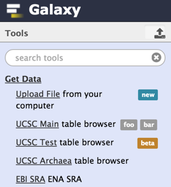

<div class='right'></div>
# Tool Panel Administration

Galaxy tool panel is located in the left of the 'Analysis page' and offers the following ways of modification.

## Adding labels to tools

You can add `labels="text"` to the <tool> XML element to render a label next to the tool in the tool panel.

## XML configuration files used to populate tool panel

The contents of the tool panel are defined by the following configuration files.

### Local tools

In the past, the file named by your **tool_config_file** configuration setting in your **config/galaxy.ini** file was the only file used to populate your Galaxy tool panel. The default name for this file is **tool_conf.xml**. Since this was the only file involved in populating your Galaxy tool panel, it defined the items (tools, workflows, sections and labels) that would be displayed and the way in which they would be arranged.

### Tool Shed tools

With the introduction of the Galaxy [Tool Shed](../../ToolShed) the **tool_config_file** setting allows for a comma-separated list of files (e.g., `tool_config_file = tool_conf.xml,shed_tool_conf.xml`,etc.). The additional shed-related tool panel configuration files (**shed_tool_conf.xml**, etc.) are automatically changed when you install or uninstall a Tool Shed repository (that contains tools) to your Galaxy.

### Migrated tools

Yet another new XML configuration file named **migrated_tools_conf.xml.sample** has been added to the Galaxy installation directory. If you start your Galaxy server using "sh run.sh" or something similar, this sample file will automatically be copied to a file named **migrated_tools_conf.xml** in the same directory. You'll be required to manually copy this file if you start your Galaxy server differently. The migrated_tools_conf.xml file is reserved to contain the XML tag sets for repositories that contain tools that were once included in the Galaxy distribution but have been moved to the Tool Shed. Similar to the approach used with the other shed-related tool panel configuration files describe above, this file's contents will be changed automatically for certain tools contained in repositories that are installed into your local Galaxy instance. More information about this process is described in the following sections.

## Managing the layout of the tool panel

The 3 or more files described in the previous section (tool_conf.xml, one or more shed_tool_conf.xml files, and migrated_tools_conf.xml) are all used to load tool panel items (tools, sections, labels and workflows). A new file named **integrated_tool_panel.xml** has been introduced to define the arrangement for displaying these loaded items in your Galaxy tool panel.
If this file does not exist in your Galaxy installation directory, it will be automatically created and populated when you start your Galaxy server. It is initially populated based on the order in which the tool panel items are loaded. The items are loaded as each tool panel configuration file is parsed and its items are loaded. The order in which these configuration files are parsed is the order of the comma-separated list of files defined in your tool_config_file setting in your config/galaxy.ini configuration file. The migrated_tools_conf.xml file is always parsed and loaded last. Let's look at an example to help clarify how this works.

Assume we have a Galaxy instance with the following entry in the config/galaxy.ini configuration file.

```
# Locally installed tools and tools installed from tool sheds
tool_config_files = tool_conf.xml,shed_tool_conf.xml```


We also have a tool_conf.xml file that looks like the following and no repositories containing tools have been installed (shed_tool_conf.xml and migrated_tools_conf.xml contain no repository tag sets).

```xml
<?xml version="1.0"?>
<toolbox>
    <section name="Get Data" id="getext">
        <tool file="data_source/upload.xml"/>
    </section>
    <label text="Basic Tools" id="basic_tools" />
</toolbox>```

Let's also assume that the file named integrated_tool_panel.xml does not yet exist in our Galaxy installation directory because we have just updated our Galaxy instance to the release that includes the new components that produce this file. Starting our Galaxy server populates the tool panel like this.


As part of the server startup process, the file named integrated_tool_panel.xml is produced since it doesn't exist. In our case, it is generated like this. Notice that the contents of this file are similar to the tool_conf.xml file shown above, but with an important difference - the tool tag includes an "id" attribute instead of a "file" attribute.

```xml
<?xml version="1.0"?>
<toolbox>
    <section id="getext" name="Get Data" version="">
        <tool id="upload1" />
    </section>
    <label id="basic_tools" text="Basic Tools" version="" />
</toolbox>
```

Let's install a tool shed repository named column_maker that contains a tool into our local instance from our proprietary local tool shed. We'll install the tool outside of any sections in our tool panel. After installation, our shed_tool_conf.xml file is automatically populated like this.

```xml
<?xml version="1.0"?>
<toolbox tool_path="../shed_tools">
    <tool file="../shed_tools/gvk.bx.psu.edu/repos/test/column_maker/f06aa1bf1e8a/column_maker/column_maker.xml" guid="gvk.bx.psu.edu:9009/repos/test/column_maker/Add_a_column1/1.1.0">
        <tool_shed>gvk.bx.psu.edu:9009</tool_shed>
        <repository_name>column_maker</repository_name>
        <repository_owner>test</repository_owner>
        <installed_changeset_revision>f06aa1bf1e8a</installed_changeset_revision
        <id>gvk.bx.psu.edu:9009/repos/test/column_maker/Add_a_column1/1.1.0</id>
        <version>1.1.0</version>
    </tool>
</toolbox>```


Our tool panel now looks like this.


A new tool tag set entry for the contained tool has been automatically appended to the document root of our integrated_tool_panel.xml file (this is an important point, and will be discussed further below), resulting in its contents looking like this.

```xml
<?xml version="1.0"?>
<toolbox>
    <label id="basic_tools" text="Basic Tools" version="" />
    <section id="getext" name="Get Data" version="">
        <tool id="upload1" />
    </section>
    <tool id="gvk.bx.psu.edu:9009/repos/test/column_maker/Add_a_column1/1.1.0" />
</toolbox>
```

After restarting the Galaxy server, our tool panel will display the label first.


In the above example, we installed a repository that contained a tool, and our shed_tool_conf.xml file, as well as our integrated_tool_panel.xml file, were automatically changed to include a tag set for the contained tool. But what happens if you manually edit your tool_conf.xml file to add a new tool that is available on your local server? Let's edit our tool_conf.xml file to add a section named "ENCODE Tools" as the first section in the file, making it look like this.

```xml
<?xml version="1.0"?>
<toolbox>
    <section name="ENCODE Tools" id="EncodeTools">
        <tool file="encode/random_intervals.xml" />
    </section>
    <section name="Get Data" id="getext">
        <tool file="data_source/upload.xml"/>
    </section>
    <label text="Basic Tools" id="basic_tools" />
</toolbox>
```

Restarting our Galaxy server produces a tool panel that looks like this. Notice that the new section named "ENCODE Tools" is displayed at the top of the tool panel since we added it to that location in our tool_conf.xml file.


If you add a new entry to a section, the section will be displayed in the order of your entries as well. Let's add another entry for a tool to our "ENCODE Tools" section in our tool_conf.xml file, making it look like this.

```xml
<?xml version="1.0"?>
<toolbox>
    <section name="ENCODE Tools" id="EncodeTools">
        <tool file="encode/gencode_partition.xml" />
        <tool file="encode/random_intervals.xml" />
    </section>
    <section name="Get Data" id="getext">
        <tool file="data_source/upload.xml"/>
    </section>
    <label text="Basic Tools" id="basic_tools" />
</toolbox>
```

Restarting our Galaxy server displays the tool panel with the "ENCODE Tools" section with tools arranged as we entered them.

Our integrated_tool_panel.xml file now looks like this.

```xml
<?xml version="1.0"?>
<toolbox>
    <section id="EncodeTools" name="ENCODE Tools" version="">
        <tool id="gencode_partition1" />
        <tool id="random_intervals1" />
    </section>
    <label id="basic_tools" text="Basic Tools" version="" />
    <section id="getext" name="Get Data" version="">
        <tool id="upload1" />
    </section>
    <tool id="gvk.bx.psu.edu:9009/repos/test/column_maker/Add_a_column1/1.1.0" />
</toolbox>
```

If you uninstall a repository that contains tools, entries for those tools will automatically be removed from the shed-related tool panel config file and the integrated_tool_panel.xml file.

The best approach for managing the new integrated_tool_panel.xml file is to allow Galaxy to add or remove entries as manually adding or removing them will likely result in undesired behavior. Manual changes to the file should simply be moving entries around to produce the desired arrangement of your tool panel.
