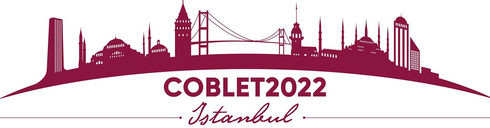

Between October 11th and 14th took place in Istambul the first Colloquium on Bioinformatics Learning, Education and Training (CoBLET). The event was held under the main theme of drawing a route for bioinformatics education and training, with a special focus in four mayor topics: emerging technologies, innovative pedagogical methods, industrial applications and sustaintable development. It took place in the Beykoz Institute of Life Sciences and Biotechnology at Bezmialem Vakıf University, and also throught an online platform. This event hold also the 11th annual general meeting of the Global Organisation for Bioinformatics Learning, Education and Training (GOBLET).

 
        

 

Cristóbal presented Galaxy in a talk with the title [Genome assembly for everyone: Galaxy Project-VGP collaboration](https://gallardoalba.github.io/COBLET2022/). He highlighted the role of the Galaxy Project in making genome assembly pipelines accesible through public computational infrastructures and providing the required training in order to exploit the potential of recent developments in sequencing technologies and assembly algorithms.