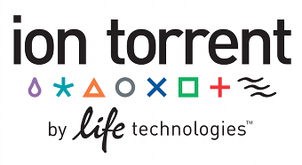

PLACEHOLDER_INCLUDE(/Events/GCC2012/PageHeader)

PLACEHOLDER_INCLUDE(/events/GCC2012/LinkBox)

**The 2012 Galaxy Community Conference (GCC2012) was held July 25-27 at the [UIC Forum](http://www.uicforum.uic.edu/) at [University of Illinois Chicago](http://uic.edu/).**
  
GCC2012 ran for [two full days](Program), and was preceded by a [full day of training workshops](Program).  GCC2012 had things in common with previous meetings (see [GDC 2010](../GDC2010), [GCC 2011](../GCC2011)), and also incorporated new features, such as the training day, based on feedback we received after the [2011 conference](/GCC2011).  

GCC2012 was hosted by the [University of Illinois at Chicago](http://uic.edu/), the [University of Illinois at Urbana-Champaign](http://illinois.edu/), and the [Computation Institute](http://www.ci.anl.gov/).

## Who Should Attend?

* **Bioinformatics tool developers and data providers**
  * Integrate your tools and resources in the Galaxy framework, increasing their visibility, and making them easier to use and integrate with other resources.
* **Workflow developers and power bioinformatics users**
  * Use Galaxy to construct complex bioinformatics workflows and then use Galaxy to share them with others, or to publish them to the world.
* **Sequencing and Bioinformatics core staff**
  * Local Galaxy deployments can talk directly with your sequencers, simplify your analysis tasks, *and* give your researchers direct access to running their own custom analysis.
* **Data and analysis archival specialists**
  * Galaxy is being used to extend the goal of reproducibility from the wet lab to the computational realm by persisting datasets *and* the computational analyses that produced them.

GCC 2012 is also an opportunity to:
* **[Present your work!](Abstracts)**
* **[Learn best practices](Program)** for deploying Galaxy, defining and installing resources, and managing and moving large datasets.
* **Network with others** in the Galaxy community who are facing similar challenges and using Galaxy (and other tools) to address them.
* Learn what the Galaxy Team's plans are, and **contribute to Galaxy's future direction**.
* Learn how to **visualize your data in Galaxy and use visualization to guide your analysis** (*visual analytics*)
* Learn when and how to use **Galaxy on the Cloud**.

## About Galaxy

[Galaxy](http://galaxyproject.org) makes it easy to perform analysis interactively through the web, on arbitrarily large datasets. With hundreds of tools there are few limits on what can be done. Now with NGS tools & workflows for short-read mapping, ChIP-seq, RNA-seq, metagenomics, and pileup analysis (including numerous Illumina-, SOLiD-, and 454-specific tools), trackster browser, collaborative pages, and support for Galaxy in the Cloud. Galaxy is distributed under the [Academic Free License](/Admin/License). 

## Sponsors

We would like to thank our sponsors for their generous support of the 2012 Galaxy Community Conference:

<table>
  <tr>
    <td style=" border: none; min-width: 40%;">  </td>
    <td style=" border: none;"> </td>
    <td style=" border: none; text-align: center;">  </td>
  </tr>
  <tr>
    <td style=" border: none; height: 100px; text-align: center;">  <strong><a href='http://www.lifetechnologies.com/'>Ion Torrent</a></strong> </td>
    <td style=" border: none;"> </td>
    <td style=" border: none; text-align: center; vertical-align: top;">  <strong><a href='http://www.emc.com/isilon'>EMC Isilon</a></strong> </td>
  </tr>
  <tr>
    <td style=" border: none;"> </td>
    <td style=" border: none;"> </td>
    <td style=" border: none;"> </td>
  </tr>
  <tr>
    <td style=" border: none;">  </td>
    <td style=" border: none;"> </td>
    <td style=" border: none; text-align: center;">  </td>
    <td style=" border: none;"> </td>
  </tr>
  <tr>
    <td style=" border: none; text-align: center;">        </td>
    <td style=" border: none;"> </td>
    <td style=" border: none; text-align: center;">       </td>
  </tr>
</table>

PLACEHOLDER_INCLUDE(Ask the Organizers)
