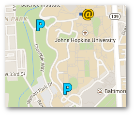

  
 We are full! 

Jan 22, 2015 Baltimore Area Galaxy Meetup @ Johns Hopkins

## Meetup Report

The first Galaxy meetup or social gathering held in Baltimore was sold out. It was the right mix of current Galaxy users, people who want to learn how to use Galaxy, and students in Biology/Computer science programs. It was good to see academics unwind with a few beers and talk about their ideas to use Galaxy. The idea behind the meetup was to build a local community of Galaxy users, and to get to know one another personally. This would in turn foster collaborations and also bring forward better feedback to the [Galaxy Team](/GalaxyTeam) as well. 

The second meetup is going to be hosted in February, for which we hope to have a slightly more focussed agenda. To talk about one or a few of the topics raised during the course of the month. There is now a [Baltimore newsletter](https://lists.galaxyproject.org/listinfo/baltimore) ([subscribe](https://lists.galaxyproject.org/listinfo/baltimore) if you are interested) which goes out to the members who signed up for the first meetup. We hope to have more people in the coming months, and to grow a stronger Galaxy community in Baltimore. 

[Enis](/EnisAfgan) & [Nitesh](/NiteshTuraga)

## There's a meetup!

Hey Everyone,

We are looking forward to kicking off our first [Galaxy Project](http://galaxyproject.org) Meetup! We will meet at one of the Galaxy project hubs - the Department of Biology of Johns Hopkins University for a general introduction to Galaxy in form of a social gathering. This will be an informal meeting open to anyone interested in data analysis, tools, computer infrastructure, programming - regardless.

[Enis Afgan](/EnisAfgan) and [Nitesh Turaga](/NiteshTuraga) of the [Galaxy team](/GalaxyTeam) will be kicking things off with a discussion on Galaxy and how researchers around the world are leveraging it. 

Thanks and hope to see you there!

### When

* January 22, 2015 (Thursday)
* 6PM to 7:30PM

### Where
[JHU Department of Biology, Mudd Hall, Undergraduate Teaching Laboratory (UTL) Rm 398, 3400 N Charles St.](http://bit.ly/1xSyrt7)

### RSVP

**We are full!** 

If you would like to be notified of future Baltimore Area Galaxy Meetups, please [subscribe to the Baltimore Area Galaxy mailing list](https://lists.galaxyproject.org/listinfo/baltimore).

### General agenda
* Introductions
* 10-15-20 minute informal presentation introducing the Galaxy project
* Socialize

#### What is Galaxy and why could it be interesting to me?
Galaxy is a web-based, open source, data integration and analysis platform for life science research. The core pillars of the application are:
* **Accessibility**: enable bench scientists to create bioinformatics analyses
* **Reproducibility**: facilitate computational methods to be completely easily reproducible
* **Transparency**: enable easy sharing and publishing of research data and analyses
A sample instance of the application that is free to use is available at [usegalaxy.org](https://usegalaxy.org/).
Although focused around Galaxy, this meetup is open to anyone interested in the above topics without their specific ties to the application.
